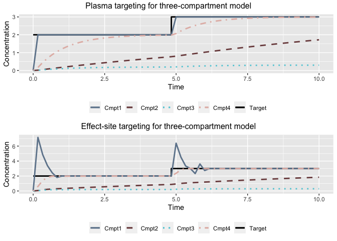

README
================

# tci

The `tci` package can be used to apply target-controlled infusion (TCI)
algorithms to 1-, 2-, and 3-compartment pharmacokinetic (PK) models with
intravenous drug administration. Three-compartment PK models with an
effect-site compartment are also supported. TCI algorithms incorporated
in the package permit plasma or effect-site targeting and incorporation
of closed-form pharmacodynamic (PD) models. Alternate user-defined PK
models, population PK models, or TCI algorithms can additionally be
specified.

## Installation

The `tci` package can be installed from GitHub using the `devtools`
package and loaded as follows.

``` r
devtools::install_github("jarretrt/tci")
library(tci)
```

## Examples

### PK Models

PK models can be evaluated by the `predict.pkmod` method in combination
with a dosing schedule. Dosing schedules should indicate infusion
starting times and rates, with the infusion termination time specified
with rate 0.

``` r
# e.g. infusion rates of 100 mg/hr for 30 sec intervals at 0, 4 minutes.
dose <- create_intvl(
  as.matrix(cbind(time = c(0.5,4,4.5,10), 
                  infrt = c(100,0,100,0)))
)
dose
```

    ##      infrt begin  end
    ## [1,]   100   0.0  0.5
    ## [2,]     0   0.5  4.0
    ## [3,]   100   4.0  4.5
    ## [4,]     0   4.5 10.0

``` r
# model parameters 
pars_3cpt <- c(k10=1.5,k12=0.15,k21=0.09,k13=0.8,
               k31=0.8,v1=10,v2=15,v3=100,ke0=1)

# predict concentrations of a three-compartment model with effect-site at
# times 1, 2, 8 minutes
predict(pkmod3cptm, 
        pars = pars_3cpt,
        inf = dose, 
        tms = c(1,2,8))
```

    ##      time        c1        c2         c3        c4
    ## [1,]    1 1.0812467 0.1708101 0.09872216 1.1317615
    ## [2,]    2 0.3558635 0.2129614 0.07501638 0.7619403
    ## [3,]    8 0.1675395 0.3914383 0.03653374 0.3157391

``` r
# plot concentrations
plot(pkmod3cptm, inf = dose, pars = pars_3cpt,
     title = "Concentrations for a 3 compartment model with an effect site")
```


Closed-form PK model solutions for 1-, 2-, and 3-compartment models are
provided by the `tci` package based on solutions and code in Abuhelwa,
Foster, and Upton (2015). Custom user-defined PK models, potentially
using ODE solvers available in other packages, can be specified and
used. See the vignette on user-defined PK functions for an example.

### TCI algorithms

TCI algorithms are iteratively applied through the function ‘tci’. Times
and target concentrations are passed as arguments along with a PK model,
PK model parameters, and (optional) initial concentrations. Times and
targets should include the time/concentration associated with the end of
the infusion schedule. Plasma or effect-site targeting is specified
through the “tci\_alg” argument, or a custom TCI algorithm is provided
through the argument “tci\_custom.”

``` r
# target concentrations of 2 for 0-5 minutes and 3 for 5-10 minutes.
tci_times <- c(0,5,10,10)
tci_targets <- c(2,3,3,3)

# plasma-targeting
inf_3cpt_plasma <- tci(Ct = tci_targets, 
                       tms = tci_times, 
                       pkmod = pkmod3cptm, 
                       pars = pars_3cpt, 
                       tci_alg = "plasma")

# infusions for effect-site targeting
inf_3cpt_effect <- tci(Ct = tci_targets, 
                       tms = tci_times, 
                       pkmod = pkmod3cptm, 
                       pars = pars_3cpt, 
                       tci_alg = "effect", 
                       cptol = 0.2)

head(inf_3cpt_effect)
```

    ##          infrt     begin       end        dt Ct c1_start   c2_start   c3_start
    ## [1,] 521.59270 0.0000000 0.1666667 0.1666667  2 0.000000 0.00000000 0.00000000
    ## [2,]   0.00000 0.1666667 0.3333333 0.1666667  2 7.157983 0.06327658 0.04862527
    ## [3,]   0.00000 0.3333333 0.5000000 0.1666667  2 4.856783 0.16024552 0.11615645
    ## [4,]   0.00000 0.5000000 0.6666667 0.1666667  2 3.382646 0.22508402 0.15220327
    ## [5,]   0.00000 0.6666667 0.8333333 0.1666667  2 2.430990 0.26923296 0.16893074
    ## [6,]  43.81325 0.8333333 1.0000000 0.1666667  2 1.809977 0.29993095 0.17395669
    ##       c4_start   c1_end     c2_end     c3_end    c4_end
    ## [1,] 0.0000000 7.157983 0.06327658 0.04862527 0.6010525
    ## [2,] 0.6010525 4.856783 0.16024552 0.11615645 1.4129871
    ## [3,] 1.4129871 3.382646 0.22508402 0.15220327 1.8170870
    ## [4,] 1.8170870 2.430990 0.26923296 0.16893074 1.9771107
    ## [5,] 1.9771107 1.809977 0.29993095 0.17395669 1.9944762
    ## [6,] 1.9944762 2.000000 0.32708413 0.17612465 1.9820862

Infusion schedules are provided in the output of ‘tci’ along with
predicted concentrations and can be plotted with the “plot.tciinf”
method.

``` r
ptci_2ug_plasma <- plot(inf_3cpt_plasma, 
                        title = "Plasma targeting for three-compartment model",
                        display = FALSE)

ptci_2ug_effect <- plot(inf_3cpt_effect, 
                        title = "Effect-site targeting for three-compartment model",
                        display = FALSE)

grid.arrange(ptci_2ug_plasma, ptci_2ug_effect)
```



### Population PK models

Functions implementing the Marsh, Schnider, and Eleveld population PK
models for propofol (PK-PD for Eleveld model) are currently provided and
can be used to calculate PK and PK-PD parameters at patient covariates
or to simulate parameters for new patients given inter-patient parameter
variability.

``` r
patient_dat <- data.frame(AGE  = c(20,40,65),
                          TBM  = c(50,70,90),
                          HGT  = c(150,170,200),
                          MALE = c(TRUE,FALSE,TRUE))

# evaluate at covariate values and return clearance parameters
patient_pk <- schnider_poppk(patient_dat, rand = FALSE, rate = FALSE)
patient_pk
```

    ##   AGE TBM HGT  MALE      LBM   V1     V2  V3       CL    Q2    Q3   KE0
    ## 1  20  50 150  TRUE 40.77778 4.27 31.803 238 1.186933 0.498 0.836 0.456
    ## 2  40  70 170 FALSE 49.80657 4.27 23.983 238 2.012072 0.978 0.836 0.456
    ## 3  65  90 200  TRUE 73.08000 4.27 14.208 238 2.131152 1.578 0.836 0.456

``` r
# evaluate TCI for patient 1
tci_patient1 <- tci(Ct = tci_targets, 
                    tms = tci_times, 
                    pkmod = pkmod3cptm, 
                    pars = patient_pk[1,], 
                    tci_alg = "effect")
head(tci_patient1)
```

    ##         infrt     begin       end        dt Ct c1_start    c2_start    c3_start
    ## [1,] 159.1048 0.0000000 0.1666667 0.1666667  2 0.000000 0.000000000 0.000000000
    ## [2,]   0.0000 0.1666667 0.3333333 0.1666667  2 5.914495 0.007837502 0.001759305
    ## [3,]   0.0000 0.3333333 0.5000000 0.1666667  2 5.360630 0.022498661 0.005055038
    ## [4,]   0.0000 0.5000000 0.6666667 0.1666667  2 4.859024 0.035747266 0.008040233
    ## [5,]   0.0000 0.6666667 0.8333333 0.1666667  2 4.404746 0.047716670 0.010744190
    ## [6,]   0.0000 0.8333333 1.0000000 0.1666667  2 3.993330 0.058527644 0.013193442
    ##       c4_start   c1_end      c2_end      c3_end    c4_end
    ## [1,] 0.0000000 5.914495 0.007837502 0.001759305 0.2227103
    ## [2,] 0.2227103 5.360630 0.022498661 0.005055038 0.6183984
    ## [3,] 0.6183984 4.859024 0.035747266 0.008040233 0.9465626
    ## [4,] 0.9465626 4.404746 0.047716670 0.010744190 1.2157835
    ## [5,] 1.2157835 3.993330 0.058527644 0.013193442 1.4336701
    ## [6,] 1.4336701 3.620730 0.068289564 0.015412023 1.6069638

`tci` functions are compatible with other user-specified population PK
models provided that they return parameters with either elimination
rate-constants named “k10”, “k12”, etc. (capitalization optional), or as
clearance parameters “CL”, “Q2”, etc.

## References

<div id="refs" class="references hanging-indent">

<div id="ref-Abuhelwa2015">

Abuhelwa, Ahmad Y., David J R Foster, and Richard N. Upton. 2015.
“ADVAN-style analytical solutions for common pharmacokinetic models.”
*Journal of Pharmacological and Toxicological Methods* 73: 42–48.
<https://doi.org/10.1016/j.vascn.2015.03.004>.

</div>

</div>
