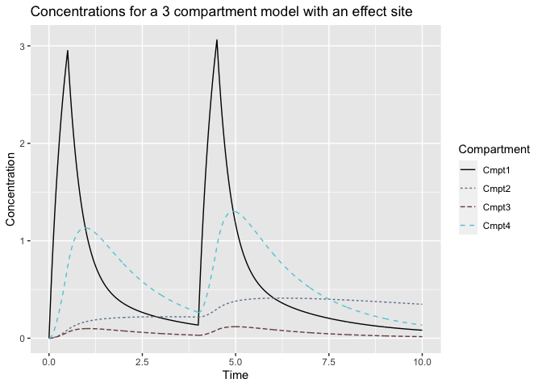

README
================

# tci

The `tci` package can be used to apply target-controlled infusion (TCI)
algorithms to 1-, 2-, and 3-compartment pharmacokinetic (PK) models with
intravenous drug administration. Three-compartment PK models with an
effect-site compartment are also supported. TCI algorithms incorporated
in the package permit plasma or effect-site targeting and incorporation
of closed-form pharmacodynamic (PD) models. Alternate user-defined PK
models, population PK models, or TCI algorithms can additionally be
specified.

## Installation

The `tci` package can be installed from GitHub using the `devtools`
package and loaded as follows.

``` r
devtools::install_github("jarretrt/tci")
library(tci)
```

## Examples

PK models can be evaluated by the `predict.pkmod` method in combination
with a dosing schedule. Dosing schedules should indicate infusion
starting times and rates, with the infusion termination time specified
with rate 0.

``` r
# e.g. infusion rates of 100 mg/hr for 30 sec intervals at 0, 4 minutes.
dose <- create_intvl(
  as.matrix(cbind(time = c(0.5,4,4.5,10), 
                  infrt = c(100,0,100,0)))
)
dose
```

    ##      infrt begin  end
    ## [1,]   100   0.0  0.5
    ## [2,]     0   0.5  4.0
    ## [3,]   100   4.0  4.5
    ## [4,]     0   4.5 10.0

``` r
# model parameters 
pars_3cpt <- c(k10=1.5,k12=0.15,k21=0.09,k13=0.8,
               k31=0.8,v1=10,v2=15,v3=100,ke0=1)

# predict concentrations of a three-compartment model with effect-site at
# times 1, 2, 8 minutes
predict(pkmod3cptm, 
        pars = pars_3cpt,
        inf = dose, 
        tms = c(1,2,8))
```

    ##      time        c1        c2        c3        c4
    ## [1,]    1 1.0812467 0.2562151 0.9872216 1.1317615
    ## [2,]    2 0.3558635 0.3194421 0.7501638 0.7619403
    ## [3,]    8 0.1675395 0.5871575 0.3653374 0.3157391

``` r
# plot concentrations
plot(pkmod3cptm, inf = dose, pars = pars_3cpt,
     title = "Concentrations for a 3 compartment model with an effect site")
```



TCI algorithms are iteratively applied through the function ‘tci’. Times
and target concentrations are passed as arguments along with a PK model,
PK model parameters, and (optional) initial concentrations. Times and
targets should include the time/concentration associated with the end of
the infusion schedule. Plasma or effect-site targeting is specified
through the “tci\_alg” argument, or a custom TCI algorithm is provided
through the argument “tci\_custom.”

``` r
# target concentrations of 2 for 0-5 minutes and 3 for 5-10 minutes.
tci_times <- c(0,5,10,10)
tci_targets <- c(2,3,3,3)

# plasma-targeting
inf_3cpt_plasma <- tci(Ct = tci_targets, 
                       tms = tci_times, 
                       pkmod = pkmod3cptm, 
                       pars = pars_3cpt, 
                       tci_alg = "plasma")

# infusions for effect-site targeting
inf_3cpt_effect <- tci(Ct = tci_targets, 
                       tms = tci_times, 
                       pkmod = pkmod3cptm, 
                       pars = pars_3cpt, 
                       tci_alg = "effect", 
                       cptol = 0.2)

ptci_2ug_plasma <- plot(inf_3cpt_plasma, 
                        title = "Plasma targeting for three-compartment model",
                        display = FALSE)

ptci_2ug_effect <- plot(inf_3cpt_effect, 
                        title = "Effect-site targeting for three-compartment model",
                        display = FALSE)

grid.arrange(ptci_2ug_plasma, ptci_2ug_effect)
```


