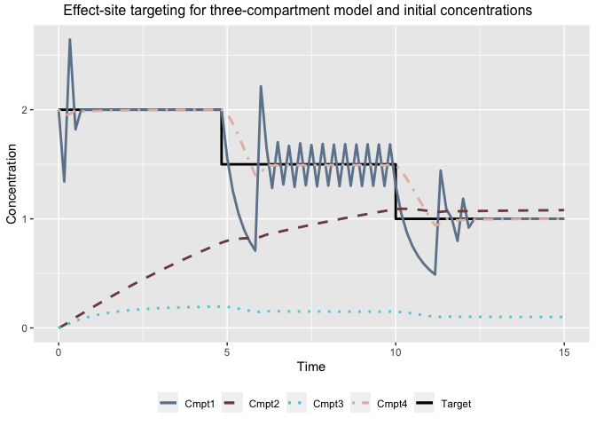
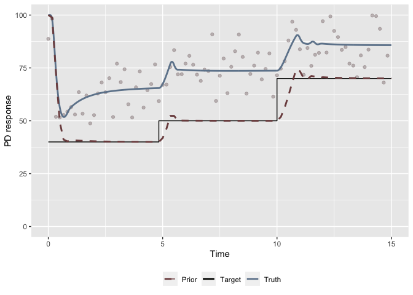
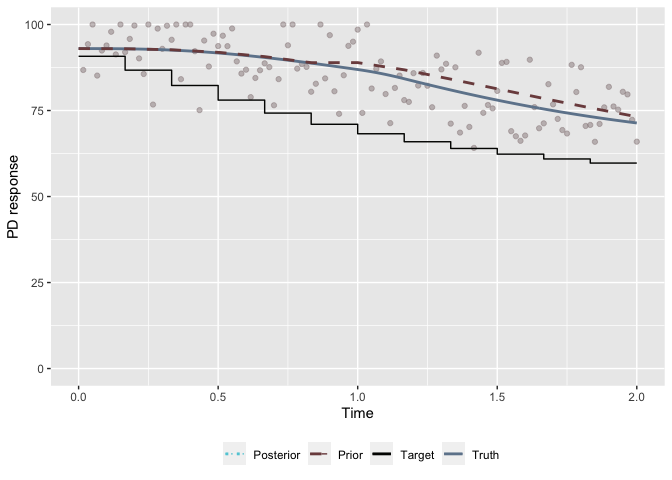
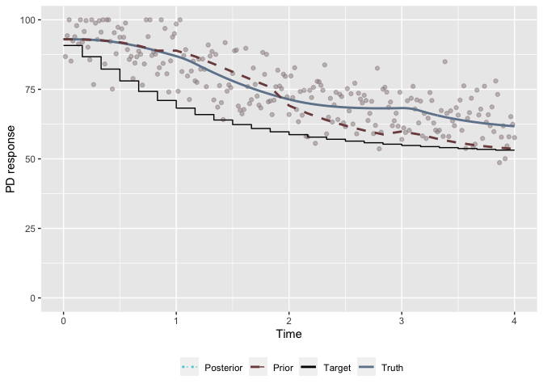
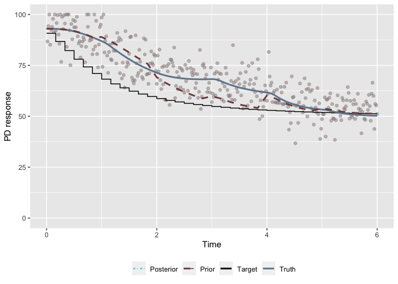
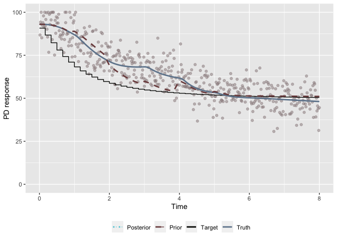
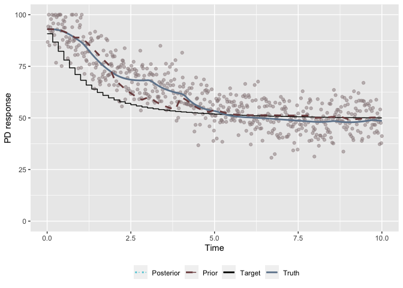

Selected examples using the TCI package
================
Ryan Jarrett
2/18/2020

In this vignette, we illustrate how to use the main functions of the
`tci` R package. The primary purpose of the package is to allow the user
to easily implement and simulate data from a variety of pharmacokinetic
and pharmacodynamic (PK-PD) models under open- or closed-loop control
using target-controlled infusion (TCI). TCI devices are used to provide
partially-automated control over the delivery of medications. The device
user typically selects from a list of PK models one believed to be
appropriate for a given patient, as well as a target concentration. The
TCI device then applies an algorithm to invert the PK model and return
an infusion rate for a set duration that is predicted to achieve the
target concentration in the patient. Though this vignette focuses on
PK-PD models and TCI algorithms commonly used for control of propofol
delivery, the functions can easily be adapted to alternate user-defined
models and algorithms.

## PK models

For illustration, we primarily demonstrate functions using a
three-compartment mammillary model with an additional effect-site
compartment. This model is selected because it is used for most
population PK models for propofol, which is commonly administered via
TCI. Nonetheless, the package contains a library with closed-form
solutions for 1, 2, and 3, compartment models with intravenous (IV)
infusions that could alternately be selected. We briefly illustrate the
use of a one-compartment model below.

A central function in the package is a `predict` method for PK models.
The user specifies a PK model from the library, model parameters, and a
matrix providing a set of infusions with begin and end times.
Predictions are returned either across a grid of points defined by the
infusion schedule or at a set of time points that the user has
specified.

``` r
(dose <- create_intvl(as.matrix(cbind(time = c(0.5,4,4.5,10), infrt = c(100,0,100,0)))))
```

    ##      infrt begin  end
    ## [1,]   100   0.0  0.5
    ## [2,]     0   0.5  4.0
    ## [3,]   100   4.0  4.5
    ## [4,]     0   4.5 10.0

``` r
pars_1cpt <- c(ke = 0.1, v = 10)
pars_3cpt <- c(k10=1.5,k12=0.15,k21=0.09,k13=0.8,k31=0.8,v1=10,v2=15,v3=100,ke0=1)

# predict for 1cpt model
head(predict(pkmod = pkmod1cpt, inf = dose, pars = pars_1cpt, init = 2, return_init = T))
```

    ##           time       c1
    ## [1,] 0.0000000 2.000000
    ## [2,] 0.1666667 3.619798
    ## [3,] 0.3333333 5.212822
    ## [4,] 0.5000000 6.779516
    ## [5,] 0.6666667 6.667461
    ## [6,] 0.8333333 6.557257

``` r
# predict for 3cpt model
head(predict(pkmod = pkmod3cptm, inf = dose, pars = pars_3cpt, return_init = T))
```

    ##           time       c1         c2          c3        c4
    ## [1,] 0.0000000 0.000000 0.00000000 0.000000000 0.0000000
    ## [2,] 0.1666667 1.372332 0.01213142 0.009322461 0.1152341
    ## [3,] 0.3333333 2.303477 0.04285376 0.031592030 0.3861326
    ## [4,] 0.5000000 2.951999 0.08600698 0.060772513 0.7345054
    ## [5,] 0.6666667 2.045738 0.12549303 0.083837533 0.9983239
    ## [6,] 0.8333333 1.461603 0.15227359 0.094919022 1.1098073

``` r
# predict for 3cpt model at specific values
predict(pkmod = pkmod3cptm, inf = dose, pars = pars_3cpt, tms = c(1,2,3))
```

    ##      time        c1        c2         c3        c4
    ## [1,]    1 1.0812467 0.1708101 0.09872216 1.1317615
    ## [2,]    2 0.3558635 0.2129614 0.07501638 0.7619403
    ## [3,]    3 0.2081186 0.2204033 0.04809046 0.4439968

There is a corresponding `plot` method for objects with class `pkmod`.

``` r
plot(pkmod = pkmod1cpt, inf = dose, pars = pars_1cpt, title = "Plasma concentrations for a 1 compartment model")
```


``` r
plot(pkmod = pkmod3cptm, inf = dose, pars = pars_3cpt, title = "Concentrations for a 3 compartment model with an effect site")
```


## Target-controlled infusion (TCI) algorithms

Another core element of the `tci` package is its implementation of TCI
algorithms. Broadly, TCI algorithms are used to invert a specified PK
model such that a target concentration is supplied to the algorithm,
which then calculates and returns the infusion rate required to reach
the target. Most existing TCI algorithms either target the concentration
in the central compartment (i.e. plasma) or the effect-site (e.g. brain)
with the goal of reaching the target in as little time as possible,
without overshooting the target. Algorithms to do this are provided by
the package for both plasma and effect-site targeting. It is entirely
possible, however, that an alternate algorithm could be desired. In this
event, it is simple for the user to supply their own algorithm.

All base TCI algorithms must take in a single target concentration as
the first argument (e.g. `Cpt`), a PK model (`pkmod`), and the duration
of the infusion administered (`dt`), and should return an infusion rate.
Below we illustrate using the plasma-targeting algorithm specified by
Jacobs (1990) for one- and three-compartment models.

``` r
# find infusion to increase plasma concentration to 2 within 2 minutes.
inf_est <- tci_plasma(Cpt = 2, dt = 2, pkmod = pkmod1cpt, pars = pars_1cpt) 
# verify that infusion will reach target at 2 minutes
plot(pkmod1cpt, pars = pars_1cpt, inf =  create_intvl(data.frame(time = c(2, 20), infrt = c(inf_est,0))), 
     title = "Infusion required to reach a plasma concentration of 2")
```


``` r
# test for 3 compartment model with initial concentration in central compartment
inf_est <- tci_plasma(Cpt = 2, dt = 2, pkmod = pkmod3cptm, pars = pars_3cpt, init = c(1,0,0,0)) 
plot(pkmod3cptm, pars = pars_3cpt, inf =  create_intvl(data.frame(time = c(2, 20), infrt = c(inf_est,0))), 
     init = c(1,0,0,0), title = "Infusion required to reach a plasma concentration of 2 in a 3cmpt model")
```


We additionally implement a version of the effect-site algorithm
described by Shafer and Gregg (1992), in which the infusion is
calculated such that the effect-site target concentration will be
reached in as little time as possible without overshoot.

``` r
# calculate the 10 second infusion rate required to reach a concentration of 1 ug/ml in the effect-site compartment with existing drug in the first compartment. 
kR_Cet <- tci_effect(Cet = 1, pkmod = pkmod3cptm, pars = pars_3cpt, init = c(1,0,0,0), dt = 1/6)
inf <- create_intvl(data.frame(time = c(1/6, 20), infrt = c(kR_Cet,0)))
plot(pkmod3cptm, inf, pars = pars_3cpt, init = c(1,0,0,0), 
     title = "10-sec infusion to reach a Cet of 1 in a 3cmpt model with initial cons")
```


``` r
# The algorithm may also be used to specify target different compartments, if desired. 
# Find 1 minute infusion required to reach a concentration of 0.5 in compartment 2 with no prior infusions. 
infdt = 1
kR_Cet_cmpt2 <- tci_effect(Cet = 0.5, pkmod = pkmod3cptm, pars = pars_3cpt, init = c(0,0,0,0), dt = infdt, cmpt = 2)
inf_cmpt2 <- create_intvl(data.frame(time = c(infdt, 20), infrt = c(kR_Cet_cmpt2,0)))
plot(pkmod3cptm, inf_cmpt2, pars = pars_3cpt, init = c(0,0,0,0),
     title = "1-min infusion to reach a c2 con of 0.5 in a 3cmpt model")
```


At the base level, a TCI algorithm is defined to return a single
infusion calculated to reach a single target. In practice, we often may
wish to calculate a series of infusions required to reach a sequence of
targets. This may be desired when gradually increasing or decreasing the
target concentration, or alternately just to maintain a specific
concentration for some duration of time. The `tci` function iterates any
base TCI algorithm to do just this by taking in a series of targets and
the times at which the targets are set and returning a series of
infusions. The targets and times passed to `tci` are used to define a
target step function. By default, the function will recalculate the
infusion rate required to maintain the current target or adjust to a new
target every 10 seconds.

``` r
tms <- c(0,5,10,15)
Cet <- c(2,1.5,1,1)

# one compartment model
tci_1cpt <- tci(Cet, tms, pkmod = pkmod1cpt, pars = pars_1cpt, tci_alg = "plasma")
plot(tci_1cpt, title = "Plasma-targeting for one-compartment model")
```


``` r
# three compartment model
tci_3cpt <- tci(Cet, tms, pkmod = pkmod3cptm, pars = pars_3cpt, tci_alg = "plasma")
plot(tci_3cpt, title = "Plasma-targeting for three-compartment model")
```


``` r
# effect-site targeting
tci_3cpt_effect <- tci(Cet, tms, pkmod = pkmod3cptm, pars = pars_3cpt)
plot(tci_3cpt_effect, title = "Effect-site targeting for three-compartment model")
```


``` r
# effect-site targeting with initial concentrations
tci_3cpt_effect_init <- tci(Cet, tms, pkmod = pkmod3cptm, pars = pars_3cpt, init = c(2,0,0,2))
plot(tci_3cpt_effect_init, title = "Effect-site targeting for three-compartment model and initial concentrations")
```



## Pharmacodynamic (PD) models

The user is also able to specify a PD model along with a PK model and
pass on target PD values, which are translated into target
concentrations through the inverse PD function, and then into infusion
rates through a specified TCI algorithm.

We illustrate the incorporation of a PD model using the four-parameter
Emax model.

``` r
# Emax model
pars_emax <- c(c50 = 1.5, gamma = 4, e0 = 100, emx = 100)
ce_seq <- seq(0,4,0.1)
# inverse Emax model
all.equal(inv_emax(emax(ce_seq, pars_emax), pars_emax), ce_seq)
```

    ## [1] TRUE

A plotting method also exists for PD models. By default, the PK profile
will be plotted alongside the PD response; however, this can be
suppressed by setting the `plot_pk` argument to false.

``` r
plot(pdmod = emax, 
     pkmod = pkmod3cptm, 
     pars_pd = pars_emax, 
     pars_pk = pars_3cpt, 
     inf = create_intvl(data.frame(time = c(2,4,6,10), 
                                   infrt = c(400,0,400,0))), 
     title = "Predicted PK-PD responses")
```


Target responses, rather than concentrations, can also be set and
evaluated by a TCI algorithm through the `tci_pd` function, which
extends the function `tci` to PD targets. The user must specify the same
PK information required by `tci` in addition to a PD model and its
inverse.

``` r
tms <- seq(0,15,5)
bist <- c(40,50,70,70)
tci_bis_res <- tci_pd(pdresp = bist, 
                      tms = tms, 
                      pdinv = inv_emax, 
                      pdmod = emax,
                      pkmod = pkmod3cptm,
                      pars_pk = pars_3cpt,
                      pars_pd = pars_emax)

# plot TCI object with pd response
plot(tci_bis_res, title = "Extension of TCI algorithm to PD targets")
```


## Simulation functions

We first introduce a function to generate data from a specified PK or
PK-PD model given a set of infusions. The infusions are passed either as
an object from the `create_intvl` or the `tci` or `tci_pd` functions.
Observation times are set through the `tms` argument. Errors are assumed
to be normally or log-normally distributed and can be specified to be
additive or multiplicative.

``` r
# Simulate PK-PD data under model misspecification.
# true parameters: pars_3cpt0, pars_emax0
# prior parameters: pars_3cpt, pars_emax
pars_3cpt0 <- c(k10=1.7,k12=0.13,k21=0.1,k13=0.8,k31=0.8,v1=15,v2=16,v3=90,ke0=1.2)
pars_emax0 <- c(c50 = 1.2, gamma = 3.5, e0 = 100, emx = 100)

# Predicted concentrations / responses under model with pars "pars_3cpt", "pars_emax"
tci_bis_res <- tci_pd(pdresp = c(40,50,70,70), 
                      tms = c(0,5,10,15), 
                      pdinv = inv_emax, 
                      pdmod = emax,
                      pkmod = pkmod3cptm,
                      pars_pk = pars_3cpt,
                      pars_pd = pars_emax)
# Generate data using infusion schedule above under a different PK-PD model
pkpddsim <- gen_data(inf = tci_bis_res, 
                     pkmod = pkmod3cptm, pars_pk0 = pars_3cpt0, 
                     pdmod = emax, pars_pd0 = pars_emax0,
                     sigma_add = 7)
head(pkpddsim$sim)
```

    ##           time           c1         c2         c3        c4   timeobs       pd0
    ## [1,] 0.0000000 2.202963e-15 0.00000000 0.00000000 0.0000000 0.0000000 100.00000
    ## [2,] 0.1666667 3.905941e+00 0.04225218 0.04442336 0.3909663 0.1666667  98.06419
    ## [3,] 0.3333333 2.572677e+00 0.10570990 0.10486889 0.8937417 0.3333333  73.71698
    ## [4,] 0.5000000 1.741391e+00 0.14673929 0.13578994 1.1143755 0.5000000  56.44140
    ## [5,] 0.6666667 1.219011e+00 0.17371528 0.14909971 1.1755067 0.6666667  51.80366
    ## [6,] 0.8333333 8.870612e-01 0.19179949 0.15206363 1.1500795 0.8333333  53.71108
    ##         pdobs
    ## [1,] 88.75705
    ## [2,] 98.24388
    ## [3,] 51.90541
    ## [4,] 51.57219
    ## [5,] 52.76800
    ## [6,] 54.28628

``` r
(p1 <- plot(pkpddsim))
```



Data can similarly be generated with later starting times and be merged
with prior data through the `combine_sim` function.

``` r
# Generate data at time t=15 with new targets and starting concentrations from previous tci
tci_bis_res_init <- tci_pd(pdresp = c(40,50,70,70), 
                           tms = c(0,5,10,15)+15, 
                           pdinv = inv_emax, 
                           pdmod = emax,
                           pkmod = pkmod3cptm,
                           pars_pk = pars_3cpt,
                           pars_pd = pars_emax, 
                           init = tci_bis_res[nrow(tci_bis_res), grep("c[0-9]_end",colnames(tci_bis_res))])

# pass in true concentrations as starting concentrations
pkpddsim_init <- gen_data(inf = tci_bis_res_init, 
                          pkmod = pkmod3cptm, 
                          pdmod = emax, 
                          pars_pk0 = pars_3cpt0, 
                          pars_pd0 = pars_emax0,
                          sigma_add = 7, 
                          init = pkpddsim$sim[nrow(pkpddsim$sim),c("c1","c2","c3","c4")])

(p12 <- plot(combine_sim(pkpddsim, pkpddsim_init)))
```


In many cases, users may wish to apply pre-existing population PK-PD
models to a data frame of patient covariates. A preliminary step in
doing this is calculating patient PK-PD parameters from the patient
covariates, given a specific model. Functions are provided in the file
`poppk_mods.R` to do this calculation for a number of commonly used
models, such as the Marsh and Schnider PK models or the Eleveld PK-PD
model. Each model should take in a data frame of patient covariates and
perform the relevant computation to calculate the patient’s
corresponding PK or PK-PD parameters. If random sampling from the
population model is desired, it should be performed within the
population PK or PK-PD function using the argument `rand`.

``` r
# Simulate PK-PD for first 5 patients based on eleveld data
data(eleveld_pk)
# pk data only with rate parameters
eleveld_poppk(eleveld_pk[1:5,], rate = T) 
```

    ##   ID       V1       V2        V3      CL     Q2      Q3 AGE WGT HGT M1F2    PMA
    ## 1  1 6.094689 16.03328  92.05801 0.94078 1.3973 0.30748  59  64 166    2 59.769
    ## 2  2 6.418785 17.92993 127.98594 1.22260 2.7529 0.71072  62  75 182    1 62.769
    ## 3  3 7.057352 27.39669 154.54782 1.13110 1.1355 0.40712  57 106 171    1 57.769
    ## 4  4 6.470785 21.18278 138.43466 1.20770 1.6362 0.53274  53  77 170    1 53.769
    ## 5  5 6.592913 16.51225 106.75174 1.29930 1.3493 0.47513  73  82 167    1 73.769
    ##   TECH    BMI    FFM A1V2       K10       K12        K21        K13         K31
    ## 1    2 23.225 41.467    1 0.2721425 0.2084115 0.07922295 0.08175547 0.005412610
    ## 2    2 22.642 60.087    1 0.2459595 0.2149238 0.07694115 0.09949187 0.004989743
    ## 3    2 36.250 67.721    1 0.2941497 0.2692390 0.06935561 0.10405293 0.004751527
    ## 4    2 26.644 57.402    1 0.2553349 0.2426171 0.07411316 0.10431770 0.004876072
    ## 5    2 29.402 58.334    1 0.2481079 0.1959639 0.07824332 0.08480119 0.005237262
    ##   LN_SIGMA     CE50       KE0 BIS0 GAMMA GAMMA2 SIGMA BIS_DELAY
    ## 1    0.191 2.644626 0.1493078   93  1.47   1.89  8.03  36.12168
    ## 2    0.191 2.594723 0.1435034   93  1.47   1.89  8.03  39.66536
    ## 3    0.191 2.678427 0.1316136   93  1.47   1.89  8.03  34.04682
    ## 4    0.191 2.747330 0.1425623   93  1.47   1.89  8.03  30.48853
    ## 5    0.191 2.419666 0.1403376   93  1.47   1.89  8.03  58.55829

``` r
# pk-pd data with clearance parameters and random error 
eleveld_poppk(eleveld_pk[1:5,], rate = F, PD = T, rand = T) 
```

    ##   ID        V1        V2        V3       CL        Q2        Q3 AGE WGT HGT
    ## 1  1 27.206642 13.305098 136.87514 3.617388 0.4052715 0.5638488  59  64 166
    ## 2  2 12.390772  7.259829 142.76369 2.208057 0.8292315 0.6327247  62  75 182
    ## 3  3 11.811594 19.636417 592.09593 1.832074 0.6244360 1.0634219  57 106 171
    ## 4  4  4.469343 50.611502  75.97435 1.626700 4.5625269 0.3102620  53  77 170
    ## 5  5 16.468766 11.934654 294.43482 1.001723 1.9984806 2.0328020  73  82 167
    ##   M1F2    PMA TECH    BMI    FFM A1V2   LN_SIGMA     CE50       KE0 BIS0 GAMMA
    ## 1    2 59.769    2 23.225 41.467    1 0.21655112 3.398970 0.2882225   93  1.47
    ## 2    1 62.769    2 22.642 60.087    1 0.22134599 2.162232 0.2770178   93  1.47
    ## 3    1 57.769    2 36.250 67.721    1 0.25694231 2.226501 0.2540659   93  1.47
    ## 4    1 53.769    2 26.644 57.402    1 0.09694973 1.590234 0.2752011   93  1.47
    ## 5    1 73.769    2 29.402 58.334    1 0.18498828 5.903761 0.2709065   93  1.47
    ##   GAMMA2     SIGMA BIS_DELAY
    ## 1   1.89 16.510252  36.12168
    ## 2   1.89  5.581762  39.66536
    ## 3   1.89  5.187118  34.04682
    ## 4   1.89  5.022184  30.48853
    ## 5   1.89 11.313986  58.55829

### Open-loop control

Given a set of patient PK-PD parameters, we may reasonably want to know
how patients would respond given a set of infusions (i.e. under
open-loop control). To illustrate open-loop control, we consider
applying open-loop control to the population of 122 patients described
in the Eleveld et al. (2018) dataset. Infusion schedules are generated
under two different conditions: 1) a target of BIS = 50, 2) a single
target sigmoid function, evaluated at the prior PK-PD parameter values
for each individual. The Eleveld PK-PD model is used in both scenarios
and the target sigmoid curve is restricted to pass through BIS = 50 at
10 minutes and reach the level of 50% effect at one minute.

<!-- ```{r, target-sigmoid} -->

<!-- tms_sigmoid <- seq(0,10,1/60) # 10 minute induction with target sigmoid -->

<!-- targets_sigmoid <- emax(tms_sigmoid, restrict_sigmoid(1)) # parameters restricted to reach mid point at t=1 minute -->

<!-- # parameters of Emax model -->

<!-- pars_emax <- c(c50 = 1.5, gamma = 4, e0 = 100, emx = 100) -->

<!-- # apply tci algorithm to sigmoid targets -->

<!-- sig_tci_targets <- tci_pd(pdresp = targets_sigmoid,  -->

<!--                           tms = tms_sigmoid,  -->

<!--                           pdinv = inv_emax,  -->

<!--                           pdmod = emax, -->

<!--                           pkmod = pkmod3cptm, -->

<!--                           pars_pk = pars_3cpt, -->

<!--                           pars_pd = pars_emax) -->

<!-- # expected concentration- and BIS-time curves -->

<!-- plot(sig_tci_targets) -->

<!-- ``` -->

<!-- Using this approach, we can simulate open-loop control for a set of patients under different infusion schedules.  -->

<!-- This infusion schedule can be applied to a population of patients so simulate an open-loop TCI scenario. For this we use a sample of 10 patients from the population of 122 patients with PK-PD observations included in the Eleveld et al. (2018) dataset. For each  -->

<!-- We first simulate the expected time-BIS course for each patient when the correct patient models are passed on to the TCI algorithm. We later illustrate the same situation in which patient parameters are simulated with random error to reflect a more accurate clinical scenario.  -->

<!-- It is worth noting that the hill parameter ("gamma") in the Eleveld PD model is fixed across the population, but varies between two values depending on if the effect-site concentration is greater than the concentration required for 50% effect. To implement this, a modification of the Emax function and its inverse is required.  -->

``` r
## Simulation without error
# Note: the parameter estimates in the Eleveld dataset are the EB estimates rather than the prior estimates

## Generate population PK-PD
# predicted model parameters for each patient - simulate without random error
ix <- ceiling(seq(1,122,length.out = 10))
eleveld_pop_prior <- eleveld_poppk(eleveld_pk[ix,], rate = T, PD = T, rand = F)
# simulate true patient parameters
set.seed(1)
eleveld_pop <- eleveld_poppk(eleveld_pk[ix,], rate = T, PD = T, rand = T)


## Infusions with fixed BIS = 50 target
fixed_tci_pop <- lapply(1:nrow(eleveld_pop), function(i){
        
        # base tci infusions on prior parameter estimates
        pars_pki <- unlist(eleveld_pop_prior[i,c("K10","K12","K21","K13","K31","V1","V2","V3","KE0")])
        pars_pdi <- unlist(eleveld_pop_prior[i,c("CE50","GAMMA","GAMMA2","BIS0","BIS0")])
        names(pars_pdi) <- c("c50","gamma","gamma2","e0","emx")
        out <- tci_pd(pdresp = c(50,50), 
                        tms = c(0,10), 
                        pdinv = inv_emax_eleveld, 
                        pdmod = emax_eleveld,
                        pkmod = pkmod3cptm,
                        pars_pk = pars_pki,
                        pars_pd = pars_pdi)
        out <- cbind(id = i, out)
        out
})


## Sigmoid targets - single set of targets, evaluated at each 
## set of prior parameters.
tms_sigmoid <- seq(0,10,1/60) # 10 minute induction with target sigmoid
targets_sigmoid <- emax(tms_sigmoid, restrict_sigmoid(1, BIS0 = eleveld_pop$BIS0[1]))

# apply tci algorithm to sigmoid targets
sig_tci_pop <- lapply(1:nrow(eleveld_pop), function(i){
        
        # base tci infusions on prior parameter estimates
        pars_pki <- unlist(eleveld_pop_prior[i,c("K10","K12","K21","K13","K31","V1","V2","V3","KE0")])
        pars_pdi <- unlist(eleveld_pop_prior[i,c("CE50","GAMMA","GAMMA2","BIS0","BIS0")])
        names(pars_pdi) <- c("c50","gamma","gamma2","e0","emx")
        out <- tci_pd(pdresp = targets_sigmoid, 
                        tms = tms_sigmoid, 
                        pdinv = inv_emax_eleveld, 
                        pdmod = emax_eleveld,
                        pkmod = pkmod3cptm,
                        pars_pk = pars_pki,
                        pars_pd = pars_pdi)
        out <- cbind(id = i, out)
        out
})

## plot expected results

fixed_pop_df <- as.data.frame(
  do.call("rbind", 
          lapply(fixed_tci_pop, function(x)x[,c("id","begin","pdt","pdresp_start")])
          )
  )

sig_pop_df <- as.data.frame(
  do.call("rbind", 
          lapply(sig_tci_pop, function(x)x[,c("id","begin","pdt","pdresp_start")])
          )
  )

p1 <- ggplot(fixed_pop_df, aes(x = begin, y = pdresp_start, group = id)) + 
        geom_line(aes(x = begin, y = pdt), color = pal[1], size = 1.2) + 
        geom_line(alpha = 0.6, color = pal[2]) +
        lims(y = c(0,100))

p2 <- ggplot(sig_pop_df, aes(x = begin, y = pdresp_start, group = id)) + 
        geom_line(aes(x = begin, y = pdt), color = pal[1], size = 1.2) + 
        geom_line(alpha = 0.6, color = pal[2]) +
        lims(y = c(0,100))

# expected time-BIS profiles
grid.arrange(p1, p2)
```


``` r
# apply tci algorithm to sigmoid targets
fixed_tci_datasim <- sig_tci_datasim <- vector("list", nrow(eleveld_pop))

for(i in 1:nrow(eleveld_pop)){
  # generate data based on "true" parameter values
  pars_pki0 <- unlist(eleveld_pop[i,c("K10","K12","K21","K13","K31","V1","V2","V3","KE0")])
  pars_pdi0 <- unlist(eleveld_pop[i,c("CE50","GAMMA","GAMMA2","BIS0","BIS0")])
  names(pars_pdi0) <- c("c50","gamma","gamma2","e0","emx")
  
  # fixed bis target
  fixed_tci_datasim[[i]] <- gen_data(inf = fixed_tci_pop[[i]], 
                        pkmod = pkmod3cptm, 
                        pdmod = emax_eleveld, 
                        pars_pk0 = pars_pki0, # true pk parameters
                        pars_pd0 = pars_pdi0, # true pd parameters
                        sigma_add = eleveld_pop[i,"SIGMA"], # random error
                        delay = eleveld_pop[i,"BIS_DELAY"], # bis delay
                        max_pdval = 100,
                        init = c(0,0,0,0))
  fixed_tci_datasim[[i]]$sim <- cbind(id = i, fixed_tci_datasim[[i]]$sim)
  
  # sigmoid target
  sig_tci_datasim[[i]] <- gen_data(inf = sig_tci_pop[[i]], 
                        pkmod = pkmod3cptm, 
                        pdmod = emax_eleveld, 
                        pars_pk0 = pars_pki0, # true pk parameters
                        pars_pd0 = pars_pdi0, # true pd parameters
                        sigma_add = eleveld_pop[i,"SIGMA"], # random error
                        delay = eleveld_pop[i,"BIS_DELAY"], # bis delay
                        max_pdval = 100,
                        init = c(0,0,0,0))
  sig_tci_datasim[[i]]$sim <- cbind(id = i, sig_tci_datasim[[i]]$sim)
        
}


fixed_tci_datasim_df <- subset(
        as.data.frame(do.call("rbind", lapply(fixed_tci_datasim, `[[`, "sim"))), 
        select = c(id,time,pd0,pdobs)
        )

sig_tci_datasim_df <- subset(
        as.data.frame(do.call("rbind", lapply(sig_tci_datasim, `[[`, "sim"))), 
        select = c(id,time,pd0,pdobs)
        )
        
p3 <- ggplot(fixed_pop_df, aes(x = begin, y = pdresp_start, group = id)) + 
        geom_line(aes(x = begin, y = pdt, group = id, color = "Target"), 
                  size = 1.2) + 
        geom_line(alpha = 0.6, aes(color = "Predicted")) +
        geom_line(data = fixed_tci_datasim_df, 
                  aes(x = time, y = pd0, group = id, color = "Observed"), 
                  alpha = 0.6) +
        lims(y = c(0,100)) +
        scale_color_manual(name = "", 
                     values = c("Target"    = unname(pal[1]), 
                                "Predicted" = unname(pal[2]),
                                "Observed"  = unname(pal[5])))

p4 <- ggplot(sig_pop_df, aes(x = begin, y = pdresp_start, group = id)) + 
        geom_line(aes(x = begin, y = pdt, group = id, color = "Target"), 
                  size = 1.2) + 
        geom_line(alpha = 0.6, aes(color = "Predicted")) +
        geom_line(data = sig_tci_datasim_df, 
                  aes(x = time, y = pd0, group = id, color = "Observed"), 
                  alpha = 0.6) +
        lims(y = c(0,100)) +
        scale_color_manual(name = "", 
                     values = c("Target"    = unname(pal[1]), 
                                "Predicted" = unname(pal[2]),
                                "Observed"  = unname(pal[5])))

grid.arrange(p3, p4)
```


### Closed-loop control

In addition to open-loop control, closed-loop control can be implemented
through Bayesian updates to a patient-specific PK or PK-PD model. We
begin by illustrating the process of updating the prior patient model
with a single set of data. In general, however, closed-loop control is
implemented through the function `bayes_control` which allows for
multiple sequential updates.

Using a target-sigmoid infusion schedule, we consider first updating the
PK-PD model parameters after data have been collected for the first five
minutes, with BIS measurements made once every 10 seconds.

``` r
# update after 5 minutes of following sigmoid targets with observations collected every second
starttm = 0; endtm = 5; dt_obs = 1/6; dt_tci = 1/60
tms_sigmoid <- seq(starttm,endtm,dt_tci) # 10 minute induction with target sigmoid
targets_sigmoid <- emax(tms_sigmoid, restrict_sigmoid(1, BIS0 = 93)) # parameters restricted to reach mid point at t=1 minute

# prior pk-pd parameters for 1st patient in Eleveld dataset
pars_pk_prior <- unlist(eleveld_pop_prior[1,c("K10","K12","K21","K13","K31","V1","V2","V3","KE0")])
pars_pd_prior <- unlist(eleveld_pop_prior[1,c("CE50","GAMMA","GAMMA2","BIS0","BIS0")])
names(pars_pd_prior) <- c("c50","gamma","gamma2","e0","emx")

# prior distribution hyperparameters
# the 'elvdlpars' function extracts the pk-pd parameters from the Eleveld dataset
lpr_eval <- elvdlpars(eleveld_pop_prior[1,])
mu0 <- elvdlpars(eleveld_pop[1,])
sig0 <- poppk_cov("Eleveld")

# Calculate tci infusions at prior parameter estimates
inf <- tci_pd(pdresp  = targets_sigmoid, 
              tms     = tms_sigmoid, 
              pdinv   = inv_emax_eleveld, 
              pdmod   = emax_eleveld,
              pkmod   = pkmod3cptm,
              pars_pk = pars_pk_prior,
              pars_pd = pars_pd_prior)

# expected time course under correct model specification
plot(inf)
```


``` r
# true pk-pd parameters for patient
pars_pk_true <- unlist(eleveld_pop[1,c("K10","K12","K21","K13","K31","V1","V2","V3","KE0")])
pars_pd_true <- unlist(eleveld_pop[1,c("CE50","GAMMA","GAMMA2","BIS0","BIS0")])

# simulate data based on true pk-pd parameters
# generate observations every second
tms_obs <- seq(dt_obs,endtm,dt_obs)
dat <- gen_data(inf = inf, 
                tms = tms_obs,
                pkmod = pkmod3cptm, 
                pdmod = emax_eleveld, 
                pars_pk0 = pars_pk_true, # true pk parameters
                pars_pd0 = pars_pd_true, # true pd parameters
                sigma_add = eleveld_pop[1,"SIGMA"], # random error
                delay = eleveld_pop[1,"BIS_DELAY"]/60, # bis delay in minutes
                max_pdval = 100,
                init = c(0,0,0,0))

# fixed parameters that need to be used, but aren't evaluated in likelihood
# ordering of parameters is important to correct use of PD function
fixed_lpr <- log(as.numeric(eleveld_pop_prior[1,c("GAMMA","GAMMA2","BIS0","BIS0")]))

# update parameter estimates with data
post_est <- nlm(f = log_posterior_neg, 
                p = unname(elvdlpars(eleveld_pop_prior[1,])),
                dat = dat, 
                mu = unname(elvdlpars(eleveld_pop[1,])),
                sig = poppk_cov("Eleveld"),
                fixed_lpr = fixed_lpr, 
                hessian = T)

plot(dat, lpars_update = post_est$estimate, lpars_fixed = fixed_lpr)
```


We may alternately wish to update a patient’s prior PK model after
collecting measurements of plasma concentrations. This is done in a
similar process as with BIS measurements and is illustrated below for a
ten-minute period targeting an effect-site concentration of two
\(\mu\)g/ml for the first five minutes and three \(\mu\)g/ml for the
final five minutes with one sample collected each minute.

``` r
# update after 10 minutes of targeting 2 ug/ml for the first 5 minutes and 3 ug/ml for the second 5 minutes, with samples drawn each minute

# prior pk parameters for 1st patient in Eleveld dataset
pars_pk_prior <- unlist(eleveld_pop_prior[1,c("K10","K12","K21","K13","K31","V1","V2","V3","KE0","LN_SIGMA")])

# true pk-pd parameters for patient
pars_pk_true <- unlist(eleveld_pop[1,c("K10","K12","K21","K13","K31","V1","V2","V3","KE0","LN_SIGMA")])

# pass in values to be targeted at each time
inf <- tci(Ct    = c(2,3,3),
           tms   = c(0,5,10), 
           pkmod = pkmod3cptm,
           pars  = pars_pk_prior)

# plot infusion schedule with predicted concentrations
plot(inf)
```


``` r
# parameter estimates and prior mean/covariance
lpr_eval <- elvdlpars(eleveld_pop_prior[1,], pd = F)
mu0 <- elvdlpars(eleveld_pop[1,], pd = F)
sig0 <- poppk_cov("Eleveld", pd = F)

# simulate data based on true pk parameters
# generate observations every minute
set.seed(1)
dat <- gen_data(inf = inf, 
                tms = 1:10,
                pkmod = pkmod3cptm, 
                pars_pk0 = pars_pk_true, # true pk parameters
                sigma_add = eleveld_pop[1,"LN_SIGMA"], # random error
                log_err = TRUE,
                init = c(0,0,0,0))

post_est <- nlm(f = log_posterior_neg, 
                p = lpr_eval,
                dat = dat, 
                mu = mu0,
                sig = sig0,
                pd_ix = NULL, 
                err_ix = 10,
                hessian = T)

plot(dat, lpars_update = post_est$estimate)
```


As referenced earlier, repeated closed-loop control is implemented for
PK-PD models through the function `bayes_control`. This function takes
in 1) a data frame of targets and corresponding times at which the
target is set, 2) the times at which updates should occur (with an
optional specification of whether or not updates should use the full
dataset or only the most recently collected observations), 3) a list of
prior PK-PD model parameters and covariance matrix, and 4) a list of
true PK-PD parameters. The function will default to using the Eleveld
PK-PD model with an effect-site targeting TCI algorithm; however, these
can be changed by the user.

We illustrate closed-loop control with BIS targets set by a sigmoid
function over a five minute period with updates occurring each minute.

``` r
# simulate for patient 1
id = 1
# prior parameters
eleveld_pop_prior <- eleveld_poppk(eleveld_pk[id,], rate = T, PD = T, rand = F)
pars_pk_prior <- unlist(eleveld_pop_prior[id,c("K10","K12","K21","K13","K31","V1","V2","V3","KE0")])
pars_pd_prior <- unlist(eleveld_pop_prior[id,c("CE50","GAMMA","GAMMA2","BIS0","BIS0")])
names(pars_pd_prior) <- c("c50","gamma","gamma2","e0","emx")

# simulate true patient parameters
set.seed(1)
eleveld_pop <- eleveld_poppk(eleveld_pk[id,], rate = T, PD = T, rand = T)
pars_pk_true <- unlist(eleveld_pop[id,c("K10","K12","K21","K13","K31","V1","V2","V3","KE0")])
pars_pd_true <- unlist(eleveld_pop[id,c("CE50","GAMMA","GAMMA2","BIS0","BIS0")])
names(pars_pd_true) <- c("c50","gamma","gamma2","e0","emx")

# list for prior distribution parameters
prior <- list(pars_pkpd = c(pars_pk_prior,pars_pd_prior),
              pk_ix = 1:9,
              fixed_ix = 11:14,
              err = eleveld_pop_prior[id,"SIGMA"],
              sig = poppk_cov("Eleveld"))

# list for prior distribution parameters
# information regarding which parameters should be updated is taken from prior object
true_pars <- list(pars_pkpd = c(pars_pk_true, pars_pd_true),
                  pk_ix = 1:9,
                  fixed_ix = 11:14,
                  err = eleveld_pop[id,"SIGMA"],
                  delay = eleveld_pop_prior[id,"BIS_DELAY"]/60)

# update after 10 minutes of following sigmoid targets with adjustments made every 10 seconds
# and BIS observations collected each second
starttm = 0; endtm = 10; dt_obs = 1/60; dt_tci = 1/6 
tms_sigmoid <- seq(starttm,endtm,dt_tci) # 10 minute induction with target sigmoid
targets <- data.frame(time = tms_sigmoid,
                      target =  emax(tms_sigmoid, restrict_sigmoid(1, BIS0 = 93)))

# specify times of updates and whether the full dataset should be used or only 
# the most recently collected samples - full updates for first three minutes, followed
# by partial updates for the remaining seven.
updates <- data.frame(time = 1:10, 
                      full_data = c(rep(TRUE,3), rep(FALSE,7)),
                      plot_progress = rep(c(FALSE,TRUE),5))

set.seed(2)
bayes_sim <- bayes_control(targets = targets, 
                           updates = updates,
                           prior = prior, 
                           true_pars = true_pars)
```

    ## [1] "Updating at time t = 1"
    ## [1] "Updating at time t = 2"



    ## [1] "Updating at time t = 3"
    ## [1] "Updating at time t = 4"



    ## [1] "Updating at time t = 5"
    ## [1] "Updating at time t = 6"



    ## [1] "Updating at time t = 7"
    ## [1] "Updating at time t = 8"



    ## [1] "Updating at time t = 9"
    ## [1] "Updating at time t = 10"



<!-- NOTE: at some point it may be useful to incorporate closed-loop control for PK models alone. This isn't done very frequently, but may at some time in the future if it becomes feasible to acquire concentration measurements from exhaled vapor.-->

Finally, we incorporate functions that will allow the user to optimize
the set of TCI targets according to an objective function. The user
specifies an objective function as well as a target function that will
have its parameters optimized to minimize the objective function. The
function could be as simple as a step function, in which the parameters
optimized correspond directly to the TCI targets (e.g. a user could
optimize the target BIS value for each minute during a 10 minute
period), or it could correspond to a parameterized function (e.g. a
linear, quadratic, or sigmoidal function) where the target is defined by
the values of the function and its parameters are optimized. The latter
case is useful for potentially drastically reducing the dimensionality
of the optimization problem.

The target function should be specified so as to translate a set of
parameters and times into a series of infusions calculated to reach
those targets according to a given TCI algorithm. The objective function
should take a `tci_inf` object as its input and return a numeric value.
Theses both can be passed on to the function `Phi_ED`, which will
average the objective function over a population of interest. `Phi_ED`
can then be optimized to provide a population-robust set of targets.

``` r
# true pk-pd parameters for sample of patients
ix <- seq(1,nrow(eleveld_pop_prior), length.out = 20)
pars_pk_all <- as.matrix(eleveld_pop[ix,c("K10","K12","K21","K13","K31","V1","V2","V3","KE0")])
pars_pd_all <- as.matrix(eleveld_pop[ix,c("CE50","GAMMA","GAMMA2","BIS0","BIS0")])
names(pars_pd_all) <- c("c50","gamma","gamma2","e0","emx")

# optimize objective function and target function over population
Phi_ED(lp = log(1), 
       targetfn = sigmoid_targetfn, 
       tms = seq(0,10,1/6),
       Phi = Phi_WgtOvershoot, 
       pars_pk_all = pars_pk_all,
       pars_pd_all = pars_pd_all)
```

    ## [1] 6512.711

<div id="refs" class="references hanging-indent">

<div id="ref-Jacobs1990">

Jacobs, James R. 1990. “Algorithm for Optimal Linear Model-Based Control
with Application to Pharmacokinetic Model-Driven Drug Delivery.” *IEEE
Transactions on Biomedical Engineering* 37 (1): 107–9.
<https://doi.org/10.1109/10.43622>.

</div>

<div id="ref-Shafer1992">

Shafer, Steven L., and Keith M. Gregg. 1992. “Algorithms to rapidly
achieve and maintain stable drug concentrations at the site of drug
effect with a computer-controlled infusion pump.” *Journal of
Pharmacokinetics and Biopharmaceutics* 20 (2): 147–69.
<https://doi.org/10.1007/BF01070999>.

</div>

</div>
