Selected examples using the TCI package
================
Ryan Jarrett
2/18/2020

<!-- ## Infusion objects -->

<!-- The package structure allows for the creation of infusion objects that are passed on to any specified PK or PK-PD model. The user can specify a dataframe with times and infusion rates expressed in terms of mL or mg. Infusion objects are returned as lists of piece-wise infusions in terms of mg/m. Unless otherwise specified, it is assumed that the infusions start at time $t=0$.  -->

<!-- The example below creates an infusion object with a rate of 1000 mL/h from time $t=0.5$ to $t=3.5$ minutes, followed by an infusion of rate 250 mL/h until time $t=8.5$ minutes.  -->

<!-- ```{r, inf-base} -->

<!-- #' Function to create an infusion object from a dosing schedule with infusion rates provided -->

<!-- inf_base <- function(d, unit = c("mg","mL"), tm_unit = c("m","h"), mgpermL = 10, inittm = 0){ -->

<!--   unit <- match.arg(unit) -->

<!--   tm_unit <- match.arg(tm_unit) -->

<!--   rt <- d$infrt -->

<!--   if(unit == "mL") rt <- rt*mgpermL -->

<!--   if(tm_unit == "h") rt <- rt / 60 -->

<!--   tms <- c(inittm, d$time) -->

<!--   return(lapply(1:length(rt), function(k) list(begin = tms[k], end = tms[k+1], k_R = rt[k]))) -->

<!-- } -->

<!-- dose <- data.frame(time = c(0.5,3.5,8.5), infrt = c(0,1000,250)) -->

<!-- inf_base(dose, unit = "mL", tm_unit = "h") -->

<!-- ``` -->

<!-- We would also like to be able to create infusion objects based on a set of target concentrations to be used by TCI algorithms. Since TCI algorithms check the target with a regular frequency, we create a function to expand the set of target infusions into one separated into regular time periods.  -->

<!-- Here the user specifies target plasma concentrations (`Cpt`) of $(0,2,1)$ for the time intervals, with the expectation that the TCI algorithm will update its target every 10 seconds (1/6 of a minute). The infusions are left-continuous, such that the final infusion finishes at the last time specified with no new infusion beginning at the final time. -->

<!-- ```{r, expand-inf} -->

<!-- #' Function to expand time / target dataframe to be passed on to TCI algorithm -->

<!-- expand_infs <- function(d, inittm = 0, freq = 1/6, val_name = NULL){ -->

<!--   library(plyr) -->

<!--   if(is.null(val_name)) val_name <- try(match.arg(c("Cpt","Cet","BIS"), names(d), several.ok = T), silent = T) -->

<!--   if(class(val_name) == "try-error") stop('Dataframe d requires the target name column to be one of c("Cpt","Cet","BIS") or specified through the val_name argument') -->

<!--   schd <- data.frame(start = c(inittm, head(d$time,-1)), end = d$time, d[val_name], freq = freq) -->

<!--   rbind(arrange(ddply(schd, val_name, summarise, time = seq(start, end-freq, by = freq)), time), c(NA,tail(d$time,1))) -->

<!-- } -->

<!-- ds <- data.frame(time = c(0.5,3.5,8.5), Cpt = c(0,2,1)) -->

<!-- head(expand_infs(ds)) -->

<!-- ``` -->

## PK models

For illustration, we consider two PK models with IV infusions: a
one-compartment model, and a three-compartment model with an effect-site
compartment.

The functions below gives the predicted concentrations in each
compartment for both models associated with a continuous infusion of 1
mg/m over five minutes.

``` r
pkmod1cpt <- function(tm, kR, pars, init = 0, inittm = 0){
  
  if(!all(hasName(pars, c("ke","v"))) & !all(hasName(pars, c("cl","v")))) stop('pars must have names "ke","v" or "cl","v"')
  tm <- tm - inittm
  
  list2env(as.list(pars), envir = environment())
  
  if("cl" %in% ls())
    ke <- cl / v
  
  return((kR/ke*(1-exp(-tm*ke)) + init*v * exp(-tm*ke)) / v)
}
class(pkmod1cpt) <- "pkmod"

tms <- seq(0,5,0.1)
pars_1cpt <- c(ke = 0.1, v = 10)
plot(tms, pkmod1cpt(tm = tms, kR = 1, pars = pars_1cpt, init = 0), type = "l", xlab = "min", ylab = "Cp")
```

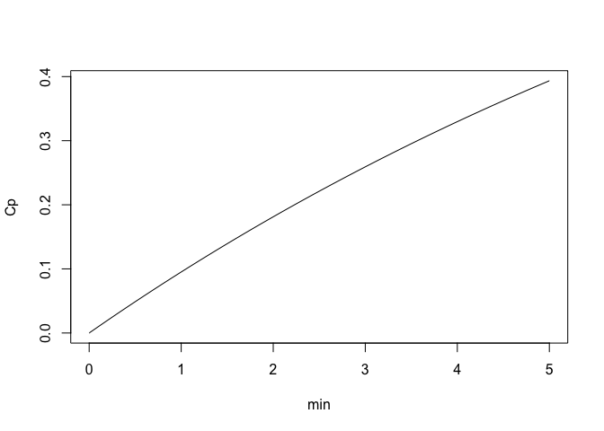

``` r
pkmod3cptm <- function(tm, kR, pars, init = c(0,0,0,0), inittm = 0, returncpt = c("all","cpt1","cpt2","cpt3","cpt4")) {

  list2env(as.list(pars), envir = environment())
  returncpt <- match.arg(returncpt)
  tm <- tm - inittm

  if(!("k20" %in% ls())){
    k20 <- 0
  }
  if(!("k30" %in% ls())){
    k30 <- 0
  }

  kme <- ke0 # k41
  km  <- kme / 1e5 # k14 Absorption into the effect site is much slower than elimination --> as soon as any drug enters, it is eliminated
  v4  <- v1 / 1e5
  # km = 0
  # v4 = 0
  E1 <- k10+k12+k13+km
  E2 <- k21+k20
  E3 <- k31+k30

  a <- E1+E2+E3
  b <- E1*E2+E3*(E1+E2)-k12*k21-k13*k31
  c <- E1*E2*E3-E3*k12*k21-E2*k13*k31

  m <- (3*b - a^2)/3
  n <- (2*a^3 - 9*a*b + 27*c)/27
  Q <- (n^2)/4 + (m^3)/27

  alpha <- sqrt(-1*Q)
  beta <- -1*n/2
  gamma <- sqrt(beta^2+alpha^2)
  theta <- atan2(alpha,beta)

  lambda1 <- a/3 + gamma^(1/3)*(cos(theta/3) + sqrt(3)*sin(theta/3))
  lambda2 <- a/3 + gamma^(1/3)*(cos(theta/3) - sqrt(3)*sin(theta/3))
  lambda3 <- a/3 -(2*gamma^(1/3)*cos(theta/3))

  A1last <- init[1]*v1
  A2last <- init[2]*v2
  A3last <- init[3]*v3
  Amlast <- init[4]*v4

  B = A2last*k21+A3last*k31
  C = E3*A2last*k21+E2*A3last*k31
  I = A1last*k12*E3-A2last*k13*k31+A3last*k12*k31
  J = A1last*k13*E2+A2last*k13*k21-A3last*k12*k21

  if(returncpt %in% c("all", "cpt1")){
    A1term1 = A1last*(exp(-tm*lambda1)*(E2-lambda1)*(E3-lambda1)/((lambda2-lambda1)*(lambda3-lambda1))+exp(-tm*lambda2)*(E2-lambda2)*(E3-lambda2)/((lambda1-lambda2)*(lambda3-lambda2))+exp(-tm*lambda3)*(E2-lambda3)*(E3-lambda3)/((lambda1-lambda3)*(lambda2-lambda3)))
    A1term2 = exp(-tm*lambda1)*(C-B*lambda1)/((lambda1-lambda2)*(lambda1-lambda3))+exp(-tm*lambda2)*(B*lambda2-C)/((lambda1-lambda2)*(lambda2-lambda3))+exp(-tm*lambda3)*(B*lambda3-C)/((lambda1-lambda3)*(lambda3-lambda2))
    A1term3 = kR*((E2*E3)/(lambda1*lambda2*lambda3)-exp(-tm*lambda1)*(E2-lambda1)*(E3-lambda1)/(lambda1*(lambda2-lambda1)*(lambda3-lambda1))-exp(-tm*lambda2)*(E2-lambda2)*(E3-lambda2)/(lambda2*(lambda1-lambda2)*(lambda3-lambda2))-exp(-tm*lambda3)*(E2-lambda3)*(E3-lambda3)/(lambda3*(lambda1-lambda3)*(lambda2-lambda3)))
    A1term = A1term1+A1term2+A1term3
  } else A1term = NULL


  if(returncpt %in% c("all", "cpt2")){
    A2term1 = A2last*(exp(-tm*lambda1)*(E1-lambda1)*(E3-lambda1)/((lambda2-lambda1)*(lambda3-lambda1))+exp(-tm*lambda2)*(E1-lambda2)*(E3-lambda2)/((lambda1-lambda2)*(lambda3-lambda2))+exp(-tm*lambda3)*(E1-lambda3)*(E3-lambda3)/((lambda1-lambda3)*(lambda2-lambda3)))
    A2term2 = exp(-tm*lambda1)*(I-A1last*k12*lambda1)/((lambda1-lambda2)*(lambda1-lambda3))+exp(-tm*lambda2)*(A1last*k12*lambda2-I)/((lambda1-lambda2)*(lambda2-lambda3))+exp(-tm*lambda3)*(A1last*k12*lambda3-I)/((lambda1-lambda3)*(lambda3-lambda2))
    A2term3 = kR*k12*(E3/(lambda1*lambda2*lambda3)-exp(-tm*lambda1)*(E3-lambda1)/(lambda1*(lambda2-lambda1)*(lambda3-lambda1))-exp(-tm*lambda2)*(E3-lambda2)/(lambda2*(lambda1-lambda2)*(lambda3-lambda2))-exp(-tm*lambda3)*(E3-lambda3)/(lambda3*(lambda1-lambda3)*(lambda2-lambda3)))
    A2term = A2term1+A2term2+A2term3
  } else A2term = NULL


  if(returncpt %in% c("all", "cpt3")){
    A3term1 = A3last*(exp(-tm*lambda1)*(E1-lambda1)*(E2-lambda1)/((lambda2-lambda1)*(lambda3-lambda1))+exp(-tm*lambda2)*(E1-lambda2)*(E2-lambda2)/((lambda1-lambda2)*(lambda3-lambda2))+exp(-tm*lambda3)*(E1-lambda3)*(E2-lambda3)/((lambda1-lambda3)*(lambda2-lambda3)))
    A3term2 = exp(-tm*lambda1)*(J-A1last*k13*lambda1)/((lambda1-lambda2)*(lambda1-lambda3))+exp(-tm*lambda2)*(A1last*k13*lambda2-J)/((lambda1-lambda2)*(lambda2-lambda3))+exp(-tm*lambda3)*(A1last*k13*lambda3-J)/((lambda1-lambda3)*(lambda3-lambda2))
    A3term3 = kR*k13*(E2/(lambda1*lambda2*lambda3)-exp(-tm*lambda1)*(E2-lambda1)/(lambda1*(lambda2-lambda1)*(lambda3-lambda1))-exp(-tm*lambda2)*(E2-lambda2)/(lambda2*(lambda1-lambda2)*(lambda3-lambda2))-exp(-tm*lambda3)*(E2-lambda3)/(lambda3*(lambda1-lambda3)*(lambda2-lambda3)))
    A3term = A3term1+A3term2+A3term3
  } else A3term = NULL

  if(returncpt %in% c("all", "cpt4")){
    Amterm1 = Amlast*exp(-tm*kme) +km*A1last*(exp(-tm*lambda1)*(E2-lambda1)*(E3-lambda1)/((lambda2-lambda1)*(lambda3-lambda1)*(kme-lambda1))+exp(-tm*lambda2)*(E2-lambda2)*(E3-lambda2)/((kme-lambda2)*(lambda1-lambda2)*(lambda3-lambda2))+exp(-tm*lambda3)*(E2-lambda3)*(E3-lambda3)/((kme-lambda3)*(lambda1-lambda3)*(lambda2-lambda3))+exp(-tm*kme)*(E2-kme)*(E3-kme)/((lambda1-kme)*(lambda2-kme)*(lambda3-kme)))
    Amterm2 = km*(exp(-tm*lambda1)*(B*lambda1-C)/((lambda1-lambda2)*(lambda1-lambda3)*(lambda1-kme))+exp(-tm*lambda2)*(C-B*lambda2)/((lambda1-lambda2)*(lambda2-lambda3)*(lambda2-kme))+exp(-tm*lambda3)*(C-B*lambda3)/((lambda1-lambda3)*(lambda3-lambda2)*(lambda3-kme))-exp(-tm*kme)*(B*kme-C)/((lambda1-kme)*(kme-lambda2)*(kme-lambda3)))
    Amterm3 = km*kR*((E2*E3)/(lambda1*lambda2*lambda3*kme)-exp(-tm*lambda1)*(E2-lambda1)*(E3-lambda1)/(lambda1*(kme-lambda1)*(lambda2-lambda1)*(lambda3-lambda1))-exp(-tm*lambda2)*(E2-lambda2)*(E3-lambda2)/(lambda2*(kme-lambda2)*(lambda1-lambda2)*(lambda3-lambda2))-exp(-tm*lambda3)*(E2-lambda3)*(E3-lambda3)/(lambda3*(kme-lambda3)*(lambda1-lambda3)*(lambda2-lambda3))-exp(-tm*kme)*(E2-kme)*(E3-kme)/(kme*(lambda1-kme)*(lambda2-kme)*(lambda3-kme)))
    Amterm = Amterm1+Amterm2+Amterm3
  } else Amterm = NULL

  return(rbind(A1term/v1, A2term/v2, A3term/v3, Amterm/v4))

}
class(pkmod3cptm) <- "pkmod"

pars_3cpt <- c(k10=1.5,k12=0.15,k21=0.09,k13=0.8,k31=0.8,v1=10,v2=15,v3=100,ke0=1)
con <- pkmod3cptm(tm = tms, kR = 1, pars = pars_3cpt, init = c(0,0,0,0))
plot(tms, tms, type = "n", ylim = range(con), ylab = "concentration (mg/mL)", xlab = "min")
sapply(1:nrow(con), function(i) lines(tms, con[i,], col = i)); legend("topleft", paste("compartment",1:4), col = 1:4, lty = 1, cex = 0.8)
```

    ## [[1]]
    ## NULL
    ## 
    ## [[2]]
    ## NULL
    ## 
    ## [[3]]
    ## NULL
    ## 
    ## [[4]]
    ## NULL

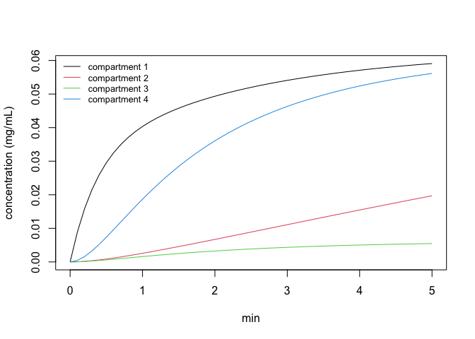

We now need to be able to extend each PK function to any arbitrary
infusion schedule. We do this by writing predict method for PK models
that takes in a dosing schedule and returns predicted concentrations
either for a grid of points across the duration of the dosing interval,
or at specified time points.

``` r
# dosing schedule
create_intvl <- function(dose, inittm = 0){
  # b <- cut2(dose$time, breaks = c(inittm,dose$time), include.lowest = TRUE, right = FALSE)
  b <- cut2(dose$time +inittm, breaks = c(inittm,dose$time+inittm), include.lowest = TRUE, right = FALSE)
  ss <- t(sapply(stringr::str_extract_all(levels(b),"-?[0-9.]+"), as.numeric))
  setNames(data.frame(levels(b), dose$infrt, ss), c("intvl","infrt","begin","end"))
}
dose <- data.frame(time = c(0.5,4,4.5,10), infrt = c(100,0,100,0))
create_intvl(dose)
```

    ##            intvl infrt begin  end
    ## 1  [0.000,0.500)   100   0.0  0.5
    ## 2  [0.500,4.000)     0   0.5  4.0
    ## 3  [4.000,4.500)   100   4.0  4.5
    ## 4 [4.500,10.000]     0   4.5 10.0

``` r
# predict method to apply pk model piecewise to infusion schedule
predict <- function (pkmod, ...) {UseMethod("predict", pkmod)}

predict.pkmod <- function(pkmod, inf, tms = NULL, dt = 1/6, len_out = NULL, return_init = FALSE, remove_bounds = TRUE, ...){

  pred <- vector("list", length(inf$infrt))
  init <- vector("list", length(inf$infrt)+1)

  # Times to evaluate concentrations at. Defaults to a sequence of values at intervals of dt.
  if(!is.null(tms)){
    b <- unique(as.numeric(unlist(stringr::str_extract_all(inf$intvl,"-?[0-9.]+"))))
    tms_all <- unique(sort(c(b,tms)))
    # tms_eval <- split(tms_all, cut(tms_all, breaks = b, right = T))
    tms_eval <- split(tms_all, findInterval(tms_all, b, rightmost.closed = T, left.open = T))
  } else{
    if(is.null(len_out)) tms_eval <- mapply(seqby, inf$begin+dt, inf$end, by = dt, SIMPLIFY = F)
    else tms_eval <- mapply(seq, inf$begin+dt, inf$end, length.out = len_out)
  }

  # Pass on initial concentrations to first element of init. Use values if specified, else defaults.
  dot.args <- list(...)
  if("init" %in% names(dot.args)){ 
    init[[1]] <- unlist(dot.args$init)
    dot.args$init <- NULL
  } else { 
    init[[1]] <- eval(formals(pkmod)$init)
  }
  
  # Predict concentrations and store initial values.
  for(i in 1:nrow(inf)){
    pred[[i]] <- do.call("pkmod", c(list(tm = tms_eval[[i]], kR = inf$infrt[i], init = init[[i]], inittm = inf$begin[i]), dot.args))
    init[[i+1]] <- tail_vec(pred[[i]]) # extract last element OR column
  }
  pred <- lapply(pred, function(x) ifelse(x < 0, 0, x))

  # Return predicted concentrations
  if(is.null(dim(pred[[1]]))) {
    predtms <- cbind(unique(unlist(tms_eval)),  do.call("c", pred))
  } else{
    predtms <- cbind(unique(unlist(tms_eval)),  t(do.call("cbind", pred)))
  }

  # Add on t=0 concentrations
  if(return_init) predtms <- rbind(c(inf$begin[1], init[[1]]), predtms)

  # remove transition concentrations
  if(!is.null(tms) & remove_bounds) predtms <- matrix(predtms[which(predtms[,1] %in% tms),], nrow = length(tms), byrow = F)
  
  colnames(predtms) <- c("time",paste0("c",1:length(init[[1]])))
  return(predtms)
}

# predict for 1cpt model
head(predict(pkmod = pkmod1cpt, inf = create_intvl(dose), pars = pars_1cpt, init = 2, return_init = T))
```

    ##           time       c1
    ## [1,] 0.0000000 2.000000
    ## [2,] 0.1666667 3.619798
    ## [3,] 0.3333333 5.212822
    ## [4,] 0.5000000 6.779516
    ## [5,] 0.6666667 6.667461
    ## [6,] 0.8333333 6.557257

``` r
# predict for 3cpt model
head(predict(pkmod = pkmod3cptm, inf = create_intvl(dose), pars = pars_3cpt, return_init = T))
```

    ##           time       c1         c2          c3        c4
    ## [1,] 0.0000000 0.000000 0.00000000 0.000000000 0.0000000
    ## [2,] 0.1666667 1.372332 0.01213142 0.009322461 0.1152341
    ## [3,] 0.3333333 2.303477 0.04285376 0.031592030 0.3861326
    ## [4,] 0.5000000 2.951999 0.08600698 0.060772513 0.7345054
    ## [5,] 0.6666667 2.045738 0.12549303 0.083837533 0.9983239
    ## [6,] 0.8333333 1.461603 0.15227359 0.094919022 1.1098073

``` r
# predict for 3cpt model at specific values
head(predict(pkmod = pkmod3cptm, inf = create_intvl(dose), pars = pars_3cpt, tms = c(1,2,3)))
```

    ##      time        c1        c2         c3        c4
    ## [1,]    1 1.0812467 0.1708101 0.09872216 1.1317615
    ## [2,]    2 0.3558635 0.2129614 0.07501638 0.7619403
    ## [3,]    3 0.2081186 0.2204033 0.04809046 0.4439968

<!-- We also create wrapper functions to evaluate the PK model at the transition point. -->

<!-- ```{r, begin-end-vals} -->

<!-- begin_vals <- function(pkmod, inf, ...) -->

<!--   cbind(inf, predict(pkmod, inf, tms = inf$begin, return_init = T, ...)[1:length(inf$begin),-1]) -->

<!-- end_vals <- function(pkmod, inf, ...) -->

<!--   cbind(inf, predict(pkmod, inf, tms = inf$begin, return_init = F, ...)[,-1]) -->

<!-- begin_vals(pkmod = pkmod3cptm, inf = create_intvl(dose), pars = pars_3cpt) -->

<!-- end_vals(pkmod = pkmod3cptm, inf = create_intvl(dose), pars = pars_3cpt) -->

<!-- ``` -->

Finally, we create a plot method for PK models with set infusions.

``` r
plot <- function(pkmod, ...) {UseMethod("plot", pkmod)}

# Note: ... arguments SHOULD be passed to plotting function instead of predict. Will fix later. 
plot.pkmod <- function(pkmod, inf, npts = 1000, title = NULL, ...){
  
  # set dt based on range between points
  dt <- diff(range(inf$begin, inf$end)) / npts
  # predict concentrations
  con <- data.frame(predict(pkmod, inf, dt = dt, return_init = T, ...))

  ggplot(melt(con, id = "time"), aes(x = time, y = value, linetype = variable, color = variable)) + 
    geom_line() + 
    labs(y = "Concentration", x = "Time", color = "Compartment", linetype = "Compartment", title = title)
}

plot(pkmod = pkmod1cpt, inf = create_intvl(dose), pars = pars_1cpt, title = "Plasma concentrations for a 1 compartment model")
```

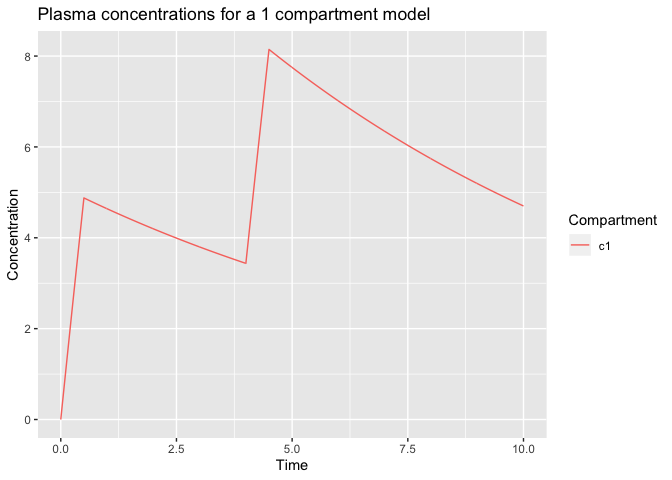

``` r
plot(pkmod = pkmod3cptm, inf = create_intvl(dose), pars = pars_3cpt, title = "Concentrations for a 3 compartment model with an effect site")
```

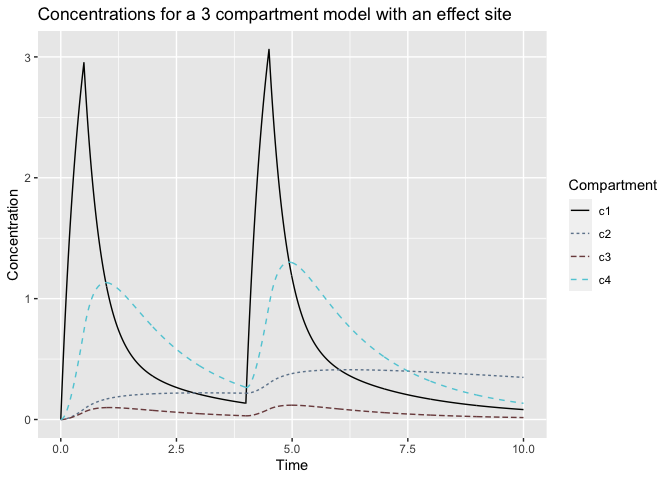

## Target-controlled infusion (TCI) algorithms

All TCI algorithms are expected to take in a target concentration value,
a PK model, and the duration of the infusion administered. Additional
arguments specifying aspects such as the maximum infusion rate or the
target compartment may be provided. When users want to supply a custom
TCI algorithm, they will write an algorithm such as the one above that
returns an infusion for a single target, as well as the amount of time
required to do so. Later on we will provide a function that extends any
TCI algorithm to multiple targets. TCI algorithms should return a vector
of length 2 with named values “kR” and “dt” indicating the infusion rate
and the duration of the infusion.

The algorithm below makes use of the approximate linearity in plasma
concentrations associated with a continuous infusion and returns the
infusion required to reach the target if administered for a duration of
`dt`.

``` r
tci_plasma <- function(Cpt, pkmod, dt, maxrt = 10000, cmpt = 1, ...){

  Cp1 <- pkmod(tm = dt, kR = 1, ...)
  Cp2 <- pkmod(tm = dt, kR = 2, ...)
  
  # for multi-compartment models, use only concentration in compartment 'cmpt'
  if(!is.null(dim(Cp1))){
    Cp1 <- Cp1[cmpt,]
    Cp2 <- Cp2[cmpt,]
  }
  
  m <- Cp2 - Cp1
  b <- Cp1 - m
  infrt <- (Cpt - b) / m
  if(infrt < 0)
    infrt <- 0
  if(infrt > maxrt)
    infrt <- maxrt
  return(c(kR = infrt, dt = dt))
}

# find infusion to increase plasma concentration to 2 within 2 minutes.
inf_est <- tci_plasma(Cpt = 2, dt = 2, pkmod = pkmod1cpt, pars = pars_1cpt) 
# verify that infusion will reach target at 2 minutes
pkmod1cpt(tm = 2, pars = pars_1cpt, kR = inf_est[1])
```

    ## kR 
    ##  2

``` r
plot(pkmod1cpt, pars = pars_1cpt, inf =  create_intvl(data.frame(time = c(2, 20), infrt = c(inf_est[1],0))), 
     title = "Infusion required to reach a plasma concentration of 2")
```

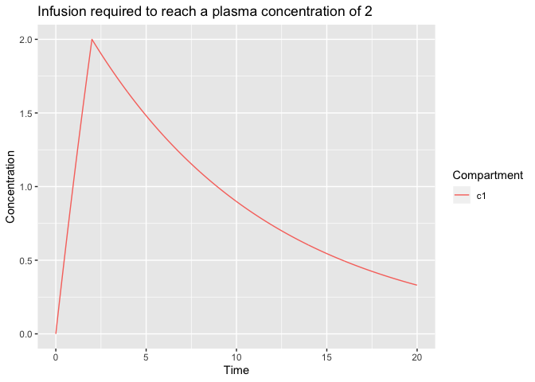

``` r
# test for 3 compartment model with initial concentrations
inf_est <- tci_plasma(Cpt = 2, dt = 2, pkmod = pkmod3cptm, pars = pars_3cpt, init = c(1,0,0,0)) 
pkmod3cptm(tm = 2, pars = pars_3cpt, kR = inf_est[1], init = c(1,0,0,0))
```

    ##             kR
    ## [1,] 2.0000000
    ## [2,] 0.3067870
    ## [3,] 0.1413099
    ## [4,] 1.5503858

``` r
plot(pkmod3cptm, pars = pars_3cpt, inf =  create_intvl(data.frame(time = c(2, 20), infrt = c(inf_est[1],0))), 
     init = c(1,0,0,0), title = "Infusion required to reach a plasma concentration of 2 in a 3cmpt model")
```

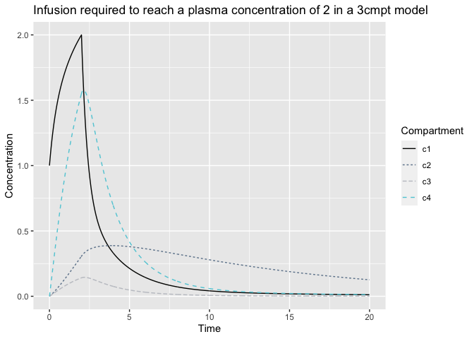

Now, we also create an effect-site TCI algorithm. This algorithm returns
the infusion that, if administerd for a duration of `dt`, will reach the
effect-site target in the minimum amount of time without overshoot.

``` r
tci_effect <- function(Cet, pkmod, dt = 1/6, max_kR = 10000, cmpt = 4, tmax_search = 20, maxrt = 200, grid_len = 1200, ...){
  
  list2env(list(...), envir = environment())
  if(is.null(init)) init <- eval(formals(pkmod)$init)
  if(is.null(pars)) pars <- try(eval(formals(pkmod)$pars), silent = T)
  if(class(pars) == "try-error") stop("PK parameters must either be provided as arguments to the TCI algorithm or as defaults to the PK model.")
  
  cmpt_name <- paste0("c",cmpt)
  
  # infusions corresponding to unit infusion for duration and a null infusion
  unit_inf <- create_intvl(data.frame(time = c(dt, tmax_search), infrt = c(1,0)))
  null_inf <- create_intvl(data.frame(time = tmax_search, infrt = 0))
  
  # predict concentrations with no additional infusions
  B <- function(tm)
    predict(pkmod, inf = null_inf, pars = pars, init = init, tms = tm)[,cmpt_name]
  
  # predict concentrations with no additional infusions
  E <- function(tm)
    predict(pkmod, inf = unit_inf, pars = pars, init = rep(0,length(init)), tms = tm)[,cmpt_name]
  
  # predict to find the longest time of maximum concentration -- will always be shorter when any prior drug has been infused.
  grid_tmax <- seq(0,tmax_search,length.out = grid_len)
  con_proj <- E(grid_tmax)
  peak_ix <- which.max(con_proj)
  con_peak <- con_proj[peak_ix]
  tpeak <- grid_tmax[peak_ix]
  
  if(all(init == 0)){
    kR <- Cet / con_peak
  } else{
    tms <- seq(0, tpeak+0.5, length.out = grid_len)
    jpeak0 = tpeak - 0.1 
    jpeak1 = jpeak0 + 0.1
    
    while(jpeak0 != jpeak1){
      jpeak0 = jpeak1
      I0 = (Cet - B(jpeak0)) / E(jpeak0)
      ceproj = B(tms) + E(tms)*I0
      jpeak1 = tms[which.max(ceproj)]
    }
    
    kR = unname((Cet-B(jpeak1)) / E(jpeak1))
  }
  
  if(kR < 0) kR = 0
  if(kR > max_kR) kR = max_kR
  
  return(c(kR = kR, dt = dt))
}  

# calculate the 10 second infusion rate required to reach a concentration of 1 ug/ml in the effect-site compartment with existing drug in the first compartment. 
kR_Cet <- tci_effect(Cet = 1, pkmod = pkmod3cptm, pars = pars_3cpt, init = c(1,0,0,0), dt = 1/6)
inf <- create_intvl(data.frame(time = c(1/6, 20), infrt = c(kR_Cet["kR"],0)))
plot(pkmod3cptm, inf, pars = pars_3cpt, init = c(1,0,0,0), 
     title = "10-sec infusion to reach a Cet of 1 in a 3cmpt model with initial cons")
```

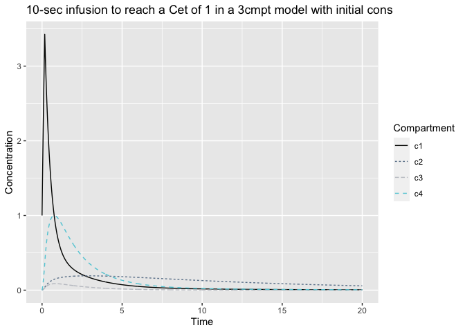

``` r
# The algorithm may also be used to specify target different compartments, if desired. 
# Find 1 minute infusion required to reach a concentration of 0.5 in compartment 2 with no prior infusions. 
infdt = 1
kR_Cet_cmpt2 <- tci_effect(Cet = 0.5, pkmod = pkmod3cptm, pars = pars_3cpt, init = c(0,0,0,0), dt = infdt, cmpt = 2)
inf_cmpt2 <- create_intvl(data.frame(time = c(infdt, 20), infrt = c(kR_Cet_cmpt2["kR"],0)))
plot(pkmod3cptm, inf_cmpt2, pars = pars_3cpt, init = c(0,0,0,0),
     title = "1-min infusion to reach a c2 con of 0.5 in a 3cmpt model")
```

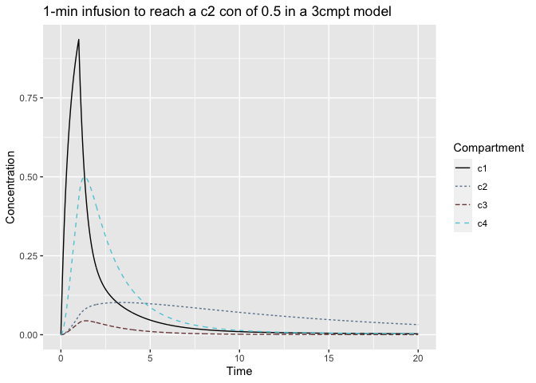

We now need a function to iterate any arbitrary TCI algorithm across a
series of targets. By default, the function will update infusion rates
at fixed intervals (e.g. every 10 seconds); however, users will have the
option of waiting only calculating infusions after the prior target has
been obtained.

The user passes the `iterate_tci` function a matrix of target
concentrations and times at which the target is set. This is translated
into a step function that defines the concentration target at all times.

<!-- 1. Set up target concentration function. -->

<!--   - The function should be left-continuous, such that each (time, Cet) combination defines the target at that time. The function will calculate infusions until the end of the time period defined. -->

<!-- 2. Define update schedule (to extent possible). Define vector of tci evaluation times (if possible), infusion durations -->

<!--   - May require function for finding and maintaining a constant infusion rate (numerically? Since it may not be possible for any arbitrary PK model) -->

``` r
iterate_tci_grid <- function(Ct, tms, tci, pkmod, pars, init = NULL, inittm = 0, dt = 1/6, ...){
  
  # adjust times such that infusions start at tm = 0
  tms <- tms - inittm
  
  # create step function to define targets at any point
  sf <- stepfun(tms, Ct)
  
  # define sequence of update times
  updatetms <- seq(0, max(tms)-dt, dt)
  
  ncpt <- length(eval(formals(pkmod)$init))
  if(is.null(init)) init <- rep(0,ncpt)
  inf <- matrix(NA, nrow = length(updatetms), ncol = 2)
  ini <- matrix(NA, nrow = ncpt, ncol = length(updatetms)+1)
  ini[,1] <- init
  
  # iterate through times
  for(i in 1:length(updatetms)){
    inf[i,] <- tci(sf(updatetms[i]), pkmod = pkmod, pars = pars, dt = dt, init = ini[,i], ...)
    ini[,i+1] <- pkmod(tm = dt, kR = inf[i,1], pars = pars, init = ini[,i])
  }
  startcon <- data.frame(matrix(ini[,-ncol(ini)], ncol = nrow(ini), nrow = ncol(ini)-1, byrow = T))
  endcon <- data.frame(matrix(ini[,-1], ncol = nrow(ini), nrow = ncol(ini)-1, byrow = T))
  
  out <- create_intvl(dose = data.frame(time = seq(dt, max(tms), dt), infrt = inf[,1]), inittm = inittm)
  out <- cbind(out, inf[,2], sf(updatetms), startcon, endcon)
  names(out) <- c("intvl","infrt","begin","end","dt","Ct",paste0("c",1:ncpt, "_start"), paste0("c",1:ncpt, "_end"))
  
  class(out) <- c(class(out),"tciinf")
  return(out)
}

tms <- c(5,10,15)
Cet <- c(2,1.5,1,1)
plot(stepfun(tms, Cet), ylim = c(0,2), xlim = c(0,15), main = "Plasma-targeting TCI algorithm", xlab = "min", ylab = "concentration")

# one compartment model
tci_1cpt <- iterate_tci_grid(Cet, tms, tci = tci_plasma, pkmod = pkmod1cpt, pars = pars_1cpt)
lines(tci_1cpt$begin, tci_1cpt$c1_start, col = 2)

# three compartment model
tci_3cpt <- iterate_tci_grid(Cet, tms, tci = tci_plasma, pkmod = pkmod3cptm, pars = pars_3cpt)
lines(tci_3cpt$begin, tci_3cpt$c1_start, col = 3)
legend("bottomright", c("One compartment", "Three compartments"), lty = c(1,1), col = c(2,3), cex = 0.8)
```

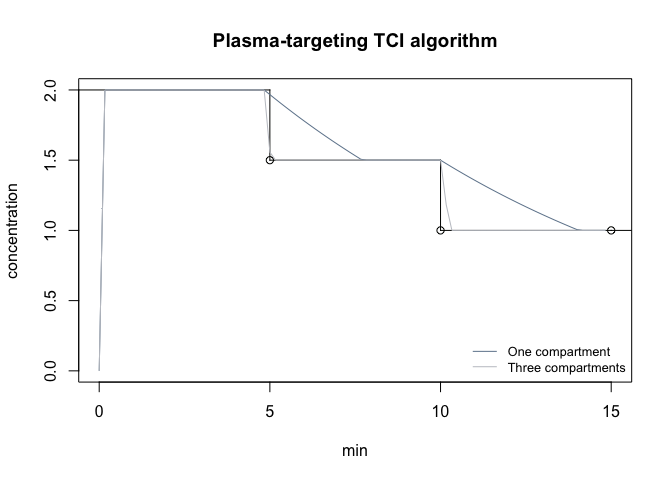

``` r
# effect-site targeting
tci_3cpt_effect <- iterate_tci_grid(Cet, tms, tci = tci_effect, pkmod = pkmod3cptm, pars = pars_3cpt)
plot(stepfun(tms, Cet), ylim = c(0,7), xlim = c(0,15), main = "Plasma-targeting TCI algorithm", xlab = "min", ylab = "concentration")
lines(tci_3cpt_effect$begin, tci_3cpt_effect$c1_start, col = 2)
lines(tci_3cpt_effect$begin, tci_3cpt_effect$c4_start, col = 3)
legend("topright", c("Plasma", "Effect site"), lty = c(1,1), col = c(2,3), cex = 0.8)
```

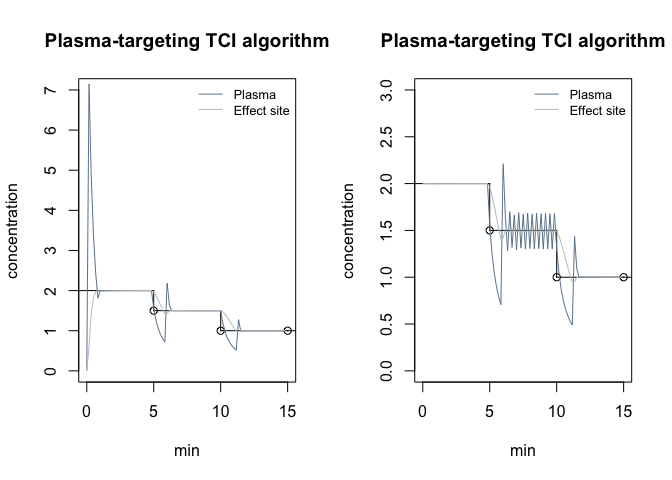

``` r
# effect-site targeting with initial concentrations
tci_3cpt_effect_init <- iterate_tci_grid(Cet, tms, tci = tci_effect, pkmod = pkmod3cptm, pars = pars_3cpt, init = c(2,0,0,2))
plot(stepfun(tms, Cet), ylim = c(0,3), xlim = c(0,15), main = "Plasma-targeting TCI algorithm", xlab = "min", ylab = "concentration")
lines(tci_3cpt_effect_init$begin, tci_3cpt_effect_init$c1_start, col = 2)
lines(tci_3cpt_effect_init$begin, tci_3cpt_effect_init$c4_start, col = 3)
legend("topright", c("Plasma", "Effect site"), lty = c(1,1), col = c(2,3), cex = 0.8)
```

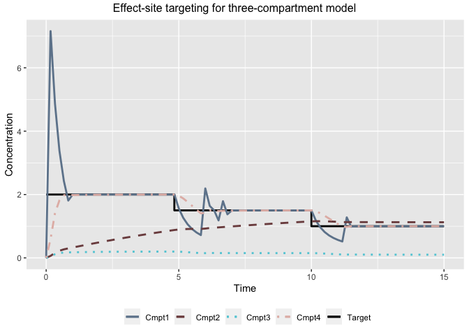

As seen in the above plot, continuing to target the effect-site results
in substantial oscillations within the plasma concentration. This can be
avoided by allowing the algorithm to switch to plasma targeting when the
plasma and effect site concentrations are within bounds of the targets.
(<span class="citeproc-not-found" data-reference-id="Jacobs1993">**???**</span>)
suggest switching when the plasma concentration is within 10% of the
target and the effect-site concentration is within 0.5% of the target.

We introduce modification of the above TCI algorithms that implements
this procedure.

``` r
tci_comb <- function(Ct, pkmod, cptol = 0.1, cetol = 0.05, cp_cmpt = 1, ce_cmpt = 4, ...){
  list2env(list(...), envir = environment())
  if(is.null(init)) init <- eval(formals(pkmod)$init)
  
  if(abs((Ct-init[cp_cmpt]) / Ct) <= cptol & abs((Ct-init[ce_cmpt]) / Ct) <= cetol){
    tci_plasma(Cpt = Ct, pkmod = pkmod, ...)
  } else{
    tci_effect(Cet = Ct, pkmod = pkmod, ...)
  }
}

tci_3cpt_comb <- iterate_tci_grid(Cet, tms, tci = tci_comb, pkmod = pkmod3cptm, pars = pars_3cpt)

plot(stepfun(tms, Cet), ylim = c(0,7), xlim = c(0,15), main = "Combined plasma- effect-site-targeting TCI algorithm", xlab = "min", ylab = "concentration")
lines(tci_3cpt_comb$begin, tci_3cpt_comb$c1_start, col = 2)
lines(tci_3cpt_comb$begin, tci_3cpt_comb$c4_start, col = 3)
legend("topright", c("Plasma", "Effect site"), lty = c(1,1), col = c(2,3), cex = 0.8, bty = "n")
```

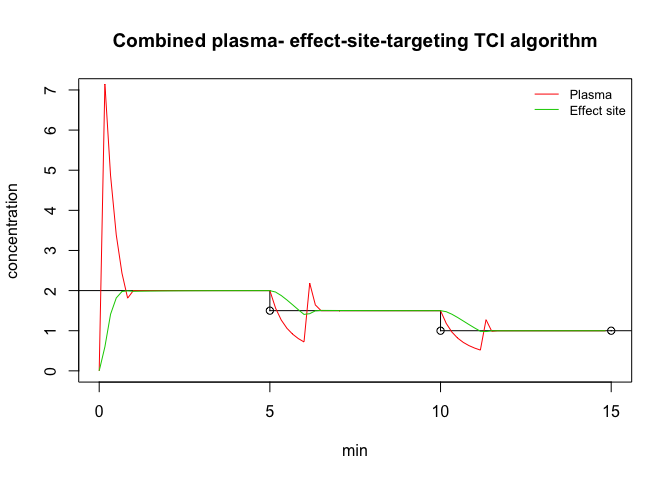

## Pharmacodynamic (PD) models

The user is also able to specify a PD model along with a PK model and
pass on target PD values, which are translated into target
concentrations through the inverse PD function, and then into infusion
rates through a specified TCI algorithm.

We illustrate the incorporation of a PD model using the four-parameter
Emax model.

``` r
#' Emax function. c50 is the concentration eliciting a 50% effect, gamma is the hill parameter identifying the slope of the Emax curve at c50, E0 is the response value with no drug present, Emax is the maximum effect size.
#' @param ce Vector of effect-site concentrations.
#' @param pars Named vector of parameter values with names (c50,gamma,E0,Emx). 
emax <- function(ce, pars) 
  pars["E0"] - pars["Emx"]*(ce^pars["gamma"] / (ce^pars["gamma"] + pars["c50"]^pars["gamma"]))
class(emax) <- "pdmod"

pars_emax <- c(c50 = 1.5, gamma = 4, E0 = 100, Emx = 100)
ce_seq <- seq(0,4,0.1)
plot(ce_seq, emax(ce_seq, pars_emax), type = "l", xlab = "Effect-site concentrtion (ug/mL)", ylab = "BIS")
```

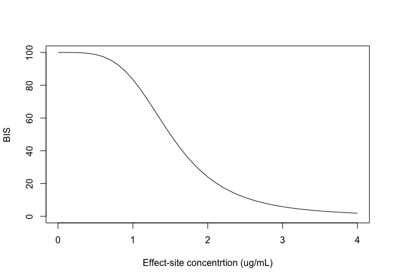

The inverse Emax function is also required.

``` r
#' Inverse Emax function that assumes Emx = E0
#' @param pdresp PD response values
#' @param pars Named vector of parameter values with names (c50,gamma,E0,Emx). 
inv_emax <- function(pdresp, pars) 
  pars["c50"] * ((pars["E0"] - pdresp) /pdresp)^(1/pars["gamma"])

all.equal(inv_emax(emax(ce_seq, pars_emax), pars_emax), ce_seq)
```

    ## [1] TRUE

We create a plotting method for PD models that allows the user to pass
in a PK-PD model and an infusion schedule and plots the corresponding PK
and PD profiles.

``` r
# Plot method for PD models. User can provide a series of effect-site concentrations and a PD model OR an infusion schedule with a PK-PD model
plot <- function(pdmod, ...) {UseMethod("plot", pdmod)}

plot.pdmod <- function(pdmod, pkmod, inf, pars_pd, pars_pk, npts = 1000, plot_pk = TRUE, title = NULL, ecmpt = NULL, ...){
  
  # set dt based on range between points
  dt <- diff(range(inf$begin, inf$end)) / npts
  # predict concentrations
  con <- data.frame(predict(pkmod, inf, dt = dt, return_init = T, pars = pars_pk, ...))
  
  # effect site comparment
  if(is.null(ecmpt)) 
    ecmpt <- length(eval(formals(pkmod)$init))
  
  # predict PD values
  pd <- data.frame(time = con$time, pdresp = pdmod(con[,ecmpt], pars_pd))
  
  if(plot_pk){
    p1 <- ggplot(melt(con, id = "time"), aes(x = time, y = value, linetype = variable, color = variable)) + 
      geom_line() + 
      labs(y = "Concentration", x = "Time", color = "Compartment", linetype = "Compartment") +
      theme(legend.position="bottom")
  } else{
    p1 <- NULL
  }
  
  p2 <- ggplot(pd, aes(x = time, y = pdresp)) +
    geom_line() +
    labs(y = "Response", x = "Time")
    
  if(!is.null(p1)){
   grid.arrange(p2, p1, nrow = 2, top = title) 
  } else{
    grid.arrange(p2, top = title)
  }
}

plot(pdmod = emax, 
     pkmod = pkmod3cptm, 
     pars_pd = pars_emax, 
     pars_pk = pars_3cpt, 
     inf = create_intvl(data.frame(time = c(2,4,6,10), 
                                   infrt = c(400,0,400,0))), 
     title = "Predicted PK-PD responses")
```


``` r
# function to extend TCI grid to a set of PD targets
tci_pd <- function(pdresp, tms, pkmod, pdmod, pars_pk, pars_pd, pdinv, tci, ecmpt = NULL, ...){
  Ct <- pdinv(pdresp, pars_pd)
  con <- iterate_tci_grid(Ct = Ct, tms = tms, tci = tci, pkmod = pkmod, pars = pars_pk, ...)
  if(is.null(ecmpt))
    ecmpt <- length(eval(formals(pkmod)$init))
  con$pdt <- pdmod(con$Ct, pars_pd)
  con$pdresp <- pdmod(con[,paste0("c",ecmpt,"_start")], pars_pd)
  return(con)
}

bist <- c(40,50,70,70)
tci_bis_res <- tci_pd(pdresp = bist, 
                      tms = tms, 
                      pdinv = inv_emax, 
                      tci = tci_comb, 
                      pdmod = emax,
                      pkmod = pkmod3cptm,
                      pars_pk = pars_3cpt,
                      pars_pd = pars_emax)
head(tci_bis_res)
```

    ##           intvl        infrt begin   end        dt       Ct c1_start   c2_start
    ## 1 [0.000,0.167) 4.320683e+02 0.000 0.167 0.1666667 1.660023 0.000000 0.00000000
    ## 2 [0.167,0.333) 8.637606e-01 0.167 0.333 0.1666667 1.660023 5.929411 0.05241601
    ## 3 [0.333,0.500) 1.777675e-03 0.333 0.500 0.1666667 1.660023 4.035036 0.13284632
    ## 4 [0.500,0.667) 1.916390e-06 0.500 0.667 0.1666667 1.660023 2.810128 0.18671696
    ## 5 [0.667,0.833) 6.161165e-04 0.667 0.833 0.1666667 1.660023 2.019362 0.22339604
    ## 6 [0.833,1.000) 3.631403e+01 0.833 1.000 0.1666667 1.660023 1.503365 0.24889854
    ##     c3_start  c4_start   c1_end     c2_end     c3_end    c4_end pdt    pdresp
    ## 1 0.00000000 0.0000000 5.929411 0.05241601 0.04027940 0.4978899  40 100.00000
    ## 2 0.04027940 0.4978899 4.035036 0.13284632 0.09630028 1.1714623  40  98.80070
    ## 3 0.09630028 1.1714623 2.810128 0.18671696 0.12627215 1.5075505  40  72.88606
    ## 4 0.12627215 1.5075505 2.019362 0.22339604 0.14018850 1.6407802  40  49.49791
    ## 5 0.14018850 1.6407802 1.503365 0.24889854 0.14437969 1.6554322  40  41.12435
    ## 6 0.14437969 1.6554322 1.660023 0.27144486 0.14618594 1.6452230  40  40.26614

``` r
class(tci_bis_res)
```

    ## [1] "data.frame" "tciinf"

``` r
# plotting method for tciinf objects. Will work for outputs from "iterate_tci_grid" or "tci_pd".
plot <- function(tciinf, ...) {UseMethod("plot", tciinf)}

plot.tciinf <- function(tciinf, title = NULL){
  
  # data frame for PK plot
  tciinfm <- melt(tciinf[,c("infrt","dt","begin","Ct",grep("\\_start",names(tciinf), value = T))], id.vars = c("infrt","dt","begin","Ct"))
  tciinfm$variable <- gsub("\\_start|c", "", tciinfm$variable)
  names(tciinfm)[names(tciinfm) == "variable"] <- "Compartment"
  
  ppk <- ggplot(tciinf[,c("begin","Ct")], aes(x = begin, y = Ct, fill = "")) + 
    geom_line(data = tciinf[,c("begin","Ct")], color = "black", size = 1.5) +
    guides(fill=guide_legend(title="Target"))  + 
    geom_line(data = tciinfm, mapping = aes(x = begin, y = value, color = Compartment), show.legend = TRUE) +
    ylim(range(tciinfm$value)) +
    labs(x = "Time", y = "Concentration") +
    theme(legend.position="bottom")
  
  if("pdresp" %in% names(tciinf)){
    ppd <- ggplot(tciinf, aes(x = begin, y = pdt)) + 
      geom_line(data = tciinf, color = "black", size = 1) +
      # guides(fill=guide_legend(title="Target effect", linetype = "dashed"))  +
      geom_line(data = tciinf,linetype = "dashed", 
                mapping = aes(x = begin, y = pdresp), show.legend = TRUE) +
      ylim(c(0,100)) +
      labs(x = "Time", y = "PD response") +
      theme(legend.position="bottom")
  }
  
  if("pdresp" %in% names(tciinf)){
   grid.arrange(ppd, ppk, nrow = 2, top = title) 
  } else{
    grid.arrange(ppk, top = title)
  }
  
}

# plot TCI object
plot(tci_3cpt_comb)
```

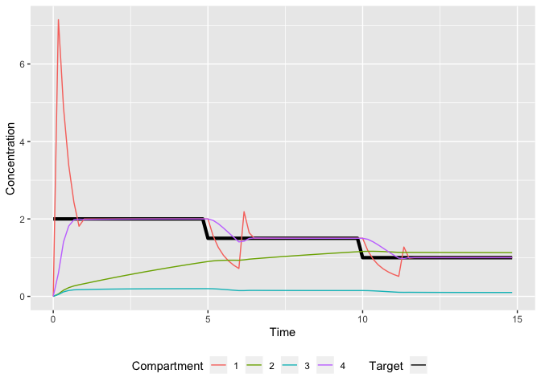

``` r
# plot TCI object with PD response
plot(tci_bis_res)
```

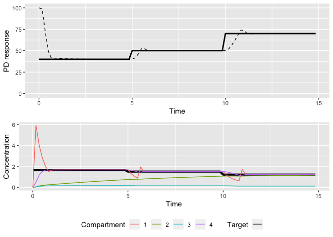

## Simulation functions

We need a function to generate data from a specified PK or PK-PD model
given a set of infusions. The infusions are passed in the form of a
matrix with columns specifying the infusion rate, the infusion duration,
and the starting time of the infusion with the column headers
(“infrt”,“begin”,“end”). All of these are provided as outputs from
both the `create_intvl` and the `iterate_tci_grid` functions, so that
the outputs can be passed directly to the `gen_data` function. Data can
be generated at alternate times by specifying a set of times through the
`tms` argument.

``` r
#' Function to simulate data from a specified PK or PK-PD model with a specified infusion schedule.
#' @param inf An infusion rate object outputted from either the 'create_intvl' function or the 'iterate_tci_grid' function

gen_data <- function(inf, pkmod, pars_pk0, sigma.add = 0, sigma.mult = 0, init = NULL, tms = NULL, pdmod = NULL, pars_pd0 = NULL, ecmpt = NULL, delay = 0, max_pdval = NULL, min_pdval = NULL){
  
  if(any(!(c("infrt","begin","end") %in% names(inf)))) stop('Names of argument "inf" must include ("infrt","begin","end").') 
  
  if(is.null(tms)){
    tms <- inf[,"begin"]
  }

  if(is.null(init)) 
    init <- eval(formals(pkmod)$init)
  
  con0 <- as.data.frame(predict(pkmod = pkmod, inf = inf, tms = tms, pars = pars_pk0, init = init))
  
  # additive and multiplicative errors
  eadd <- rnorm(nrow(con0),0,sigma.add)
  emult <- rnorm(nrow(con0),0,sigma.mult)
  if(is.null(pdmod)){
    con0$cobs <- con0[,"c1"]*(1+emult) + eadd
  } else{
    # possible time delay
    con0$timeobs <- con0$time + delay 
    
    if(is.null(ecmpt))
      ecmpt <- length(eval(formals(pkmod)$init))
    
    # pd observations
    con0$pd0 <- pdmod(con0[,paste0("c",ecmpt)], pars_pd0)
    con0$pdobs <- con0$pd0*(1+emult) + eadd
    
    # replace with max/min values if necessary
    con0$pdobs[con0$pdobs > max_pdval] <- max_pdval
    con0$pdobs[con0$pdobs < min_pdval] <- min_pdval
  }
  
  out <- list(sim = con0,
              inf = inf,
              pkmod = pkmod, 
              pdmod = pdmod, 
              pars_pk = pars_pk0, 
              pars_pd = pars_pd0,
              sigma.add = sigma.add, 
              sigma.mult = sigma.mult,
              ecmpt = ecmpt, 
              delay = delay)
  class(out) <- c(class(out), "datasim")
  return(out)
}

# new set of PK parameters for 3 compartment model
pars_3cpt0 <- c(k10=1.7,k12=0.13,k21=0.1,k13=0.8,k31=0.8,v1=15,v2=16,v3=90,ke0=1.2)
# generate PK data sampled each minute with multiplicative error
pkdsim <- gen_data(inf = create_intvl(dose), pkmod = pkmod3cptm, pars_pk0 = pars_3cpt0, 
         tms = seq(0,10,1), sigma.mult = 0.5)
head(pkdsim$sim)
```

    ##   time           c1        c2         c3        c4         cobs
    ## 1    0 5.088522e-16 0.0000000 0.00000000 0.0000000 3.670471e-16
    ## 2    1 6.418808e-01 0.1315914 0.10400430 0.7868619 5.461915e-01
    ## 3    2 1.980316e-01 0.1585140 0.07587971 0.4506107 3.287091e-01
    ## 4    3 1.135529e-01 0.1606567 0.04729925 0.2344957 7.070973e-02
    ## 5    4 7.191600e-02 0.1558671 0.02934405 0.1313347 1.013848e-01
    ## 6    5 6.888149e-01 0.2793757 0.12240028 0.8655525 4.696260e-01

``` r
# generate PK data for infusions starting at time t=10 using 
# final concentrations from prior simulation as initial values
dosetm10 <- dose
dosetm10$time  <- dosetm10$time+10
inittm10 <- unlist(tail(pkdsim$sim[,c("c1","c2","c3","c4")], 1))
pkdsimtm10 <- gen_data(inf = create_intvl(dosetm10, inittm = 10), 
                       pkmod = pkmod3cptm, 
                       pars_pk0 = pars_3cpt0, 
                       tms = seq(10,20,1), 
                       sigma.mult = 0.5, 
                       init = inittm10)
head(pkdsimtm10$sim)
```

    ##   time         c1        c2         c3         c4       cobs
    ## 1   10 0.04104811 0.2375391 0.01427799 0.06184166 0.04025275
    ## 2   11 2.57031392 0.4186417 0.17941082 1.38331245 3.74185267
    ## 3   12 3.06976550 0.7106685 0.34576793 2.44599128 3.38642609
    ## 4   13 3.32465164 1.0153404 0.45130792 2.99557225 3.22273945
    ## 5   14 3.48325990 1.3143458 0.51668983 3.29577876 3.87768238
    ## 6   15 3.58579764 1.5997175 0.55750275 3.47204893 5.66077678

``` r
# new set of PD parameters for Emax model
pars_emax0 <- c(c50 = 1.2, gamma = 3.5, E0 = 100, Emx = 100)

# Simulate PK-PD data under model misspecification.
# Predicted concentrations / responses under model with pars "pars_3cpt", "pars_emax"
tci_bis_res <- tci_pd(pdresp = c(40,50,70,70), 
                      tms = c(5,10,15), 
                      pdinv = inv_emax, 
                      tci = tci_comb, 
                      pdmod = emax,
                      pkmod = pkmod3cptm,
                      pars_pk = pars_3cpt,
                      pars_pd = pars_emax)
# Generate data using infusion schedule above under a different PK-PD model
pkpddsim <- gen_data(inf = tci_bis_res, 
                     pkmod = pkmod3cptm, pars_pk0 = pars_3cpt0, 
                     pdmod = emax, pars_pd0 = pars_emax0,
                     sigma.add = 7, delay = 15/60, max_pdval = 100)
head(pkpddsim$sim)
```

    ##    time           c1         c2         c3       c4 timeobs       pd0    pdobs
    ## 1 0.000 2.198589e-15 0.00000000 0.00000000 0.000000   0.250 100.00000 99.42620
    ## 2 0.167 3.904439e+00 0.04232536 0.04449669 0.391594   0.417  98.05350 95.29748
    ## 3 0.333 2.583681e+00 0.10563942 0.10482346 0.893471   0.583  73.73752 77.45979
    ## 4 0.500 1.747239e+00 0.14691584 0.13597648 1.116014   0.750  56.31497 66.90152
    ## 5 0.667 1.222111e+00 0.17402966 0.14937714 1.177732   0.917  51.63835 53.88034
    ## 6 0.833 8.903181e-01 0.19210184 0.15236279 1.152583   1.083  53.52180 56.07261

``` r
# Generate data at time t=15 with new targets and starting concentrations
tci_bis_res_init <- tci_pd(pdresp = c(40,50,70,70), 
                           tms = c(5,10,15)+15, 
                           pdinv = inv_emax, 
                           tci = tci_comb, 
                           pdmod = emax,
                           pkmod = pkmod3cptm,
                           pars_pk = pars_3cpt,
                           pars_pd = pars_emax, 
                           init = unlist(tail(
                             pkpddsim$inf[,c("c1_end","c2_end","c3_end","c4_end")]
                             ,1)),
                           inittm = 15
                           )

# pass in true concentrations as starting concentrations
pkpddsim_init <- gen_data(inf = tci_bis_res_init, 
              pkmod = pkmod3cptm, pars_pk0 = pars_3cpt0, 
              pdmod = emax, pars_pd0 = pars_emax0,
              sigma.add = 7, delay = 15/60, max_pdval = 100,
              init = unlist(tail(pkpddsim$sim[,c("c1","c2","c3","c4")], 1)))
head(pkpddsim_init$sim)
```

    ##     time        c1        c2        c3        c4 timeobs      pd0    pdobs
    ## 1 15.000 0.7186604 0.7901105 0.1199457 0.7185845  15.250 85.75120 85.77820
    ## 2 15.167 2.0544208 0.8060108 0.1351474 0.8525677  15.417 76.78811 80.92805
    ## 3 15.333 1.4374085 0.8272807 0.1538968 1.0078113  15.583 64.81443 69.39176
    ## 4 15.500 1.0410106 0.8382808 0.1600781 1.0459352  15.750 61.79687 67.17871
    ## 5 15.667 0.9838943 0.8447880 0.1611034 1.0392904  15.917 62.32209 65.02271
    ## 6 15.833 0.9865936 0.8506498 0.1614913 1.0295484  16.083 63.09291 71.28328

``` r
# function to merge datasim objects from different infusion schedules
combine_sim <- function(...){
  simlist <- list(...)
  
  out <- vector("list", length(simlist[[1]]))
  names(out) <- names(simlist[[1]])
  
  out$sim <- do.call("rbind", lapply(simlist, `[[`, "sim"))
  out$inf <- do.call("rbind", lapply(simlist, `[[`, "inf"))
  
  lnames <- names(out[sapply(out, is.null)])
  for(i in 1:length(lnames)){
    if(length(unique(lapply(simlist, `[[`, lnames[i]))) == 1){
      out[[lnames[i]]] <- simlist[[1]][[lnames[i]]]
    } else{
      lapply(simlist, `[[`, lnames[i])
    }
  }
  class(out) <- c(class(out), "datasim")
  return(out)
}
```

We also would like a plot method for simulated data.

``` r
plot <- function(datasim, ...) {UseMethod("plot", datasim)}

plot.datasim <- function(datasim){
  
  r <- range(datasim$sim$time)
  tms <- seq(r[1], r[2], diff(r)/1000)
  
  cp <- data.frame(predict(pkmod = datasim$pkmod, 
                           inf = datasim$inf, 
                           tms = tms, 
                           pars = datasim$pars_pk, 
                           init = unlist(head(datasim$inf[,c("c1_start","c2_start","c3_start","c4_start")],1))))
  
  if(is.null(datasim$pdmod)){
    
    out <- ggplot(cp, aes(x = time, y = c1)) + 
      geom_line() +
      geom_point(data = datasim$sim, aes(x = time, y = cobs), shape = 1, col = "red") +
      labs(x = "Time (min)", y = "Concentration")
    
  } else{
    cp$pdp <- datasim$pdmod(ce = cp[,paste0("c",datasim$ecmpt)], pars = datasim$pars_pd)
    
    out <- ggplot(cp, aes(x = time, y = pdp)) + 
      geom_line() +
      geom_point(data = datasim$sim, aes(x = time, y = pdobs), shape = 1, col = "red") +
      labs(x = "Time (min)", y = "Effect")
  }
  
  out
}

plot(pkpddsim)
```

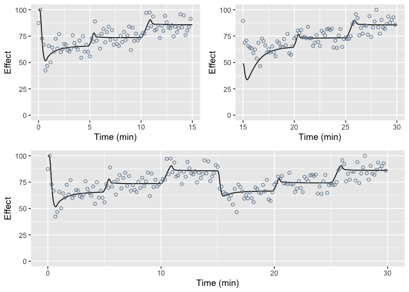

``` r
plot(pkpddsim_init)
```

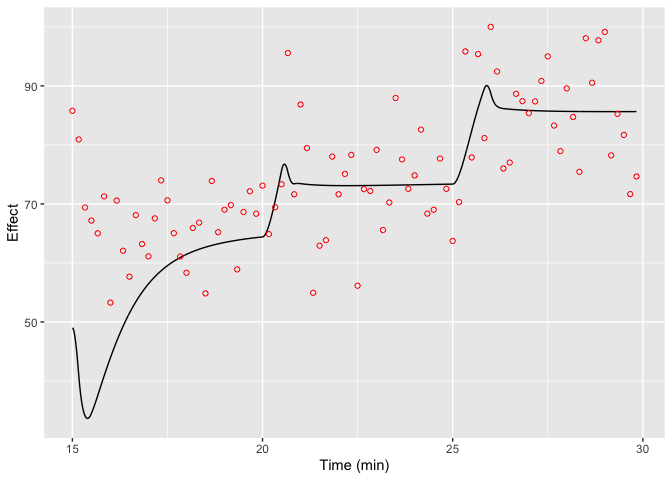

``` r
plot(combine_sim(pkpddsim, pkpddsim_init))
```

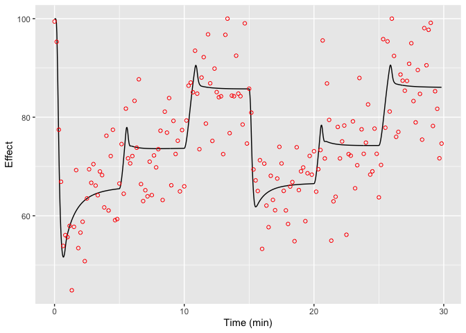

We now define functions to generate hypothetical patient PK-PD data
according to specified population PK or PK-PD models. While a number of
commonly used models are provided in the file `poppk_mods.R`, such as
the Marsh and Schnider PK models or the Eleveld PK-PD model, it is also
possible for the user to define custom PK models. Each model should take
in a dataframe of patient covariates and perform the relevant
computation to calculate the patient’s corresponding PK or PK-PD
parameters. If random sampling from the population model is desired, it
should be performed within the population PK or PK-PD function using the
argument `rand`.

The `apply_poppk` function is a wrapper function for applying the stored
population models.

``` r
apply_poppk <- function(patient_df, mod = c("marsh","schnider","eleveld"), ...){
  switch(match.arg(mod),
         marsh = marsh_poppk(patient_df, ...),
         schnider = schnider_poppk(patient_df, ...),
         eleveld = eleveld_poppk(patient_df, ...))
}

source("./R/poppk_mods.R")
dat <- data.frame(AGE  = c(20,40,65),
                  TBM  = c(50,70,90),
                  HGT  = c(150,170,200),
                  MALE = c(TRUE,FALSE,TRUE))
identical(schnider_poppk(dat, rand = F, rate = F), apply_poppk(dat, "schnider"))
```

    ## [1] TRUE

<!-- We now need a function to perform Bayesian updates to a PK-PD model parameters with simulated data. To do this, we first define functions for the log prior, log likelihood, and log posterior.  -->

<!-- ```{r, update-pkpd} -->

<!-- #' Parameter estimates from Eleveld et al. (2018) -->

<!-- eleveld_eta_pk_var <- c(0.610,0.565,0.597,0.265,0.346,0.209,0.463) -->

<!-- eleveld_eta_pd_var <- c(0.242,0.702,0.230) -->

<!-- lvars <- c(eleveld_eta_pk_var, eleveld_eta_pd_var) -->

<!-- names(lvars) <- c("V1","V2","V3","CL","Q2","Q3","RESID_PK","Ce50","ke0","RESID_PD") -->

<!-- lvars <- c(lvars, c(k10 = unname(lvars["CL"] + lvars["V1"]), -->

<!--                     k12 = unname(lvars["Q2"] + lvars["V1"]), -->

<!--                     k21 = unname(lvars["Q2"] + lvars["V2"]), -->

<!--                     k13 = unname(lvars["Q3"] + lvars["V1"]), -->

<!--                     k31 = unname(lvars["Q3"] + lvars["V3"]))) -->

<!-- lhyper0 <- diag(lvars[c("k10","k12","k21","k13","k31","V1","V2","V3","ke0","Ce50","RESID_PD")]) -->

<!-- #' Function to return the prior probability for a set of parameters assuming they are log-normally distributed. -->

<!-- #' It is assumed that the last value of of lpr is the prior mean for the variance parameter. -->

<!-- #' @param lpr log parameter values to evaluate -->

<!-- #' @param lhyper hyperparameters for mean and error distributions. List with values "mu", "sig" described below. -->

<!-- #' mu: mean for model parameters and mean of the error distribution -->

<!-- #' sig: variance covariance matrix for model parameters and standard deviation of error distribution -->

<!-- log_prior <- function(lpr, lhyper){ -->

<!--   dmvnorm(lpr, lhyper$mu, lhyper$sig, log = TRUE) -->

<!-- } -->

<!-- lpr <- log(c(pars_3cpt0, pars_emax0)) -->

<!-- lhyper -->

<!-- log_prior(lpr, ) -->

<!-- #' @param lpr log parameter values to evaluate -->

<!-- #' @param datasim object of class "datasim"  -->

<!-- log_likelihood <- function(lpr, datasim, ...){ -->

<!--   epr <- exp(lpr) -->

<!--   pklen <- length(datasim$pars_pk) -->

<!--   cp <- data.frame(predict(pkmod = datasim$pkmod,  -->

<!--                          inf = datasim$inf,  -->

<!--                          tms = datasim$sim$time, -->

<!--                          pars = head(epr,pklen), ...)) -->

<!--   pdp <- datasim$pdmod(ce = cp[,paste0("c",datasim$ecmpt)], pars = tail(epr,length(epr)-pklen)) -->

<!--   sum(truncnorm::dtruncnorm(x = datasim$sim$pdobs,  -->

<!--                             mean = pdp,  -->

<!--                             sd = datasim$sigma.add,  -->

<!--                             a = 0, b = 100)) -->

<!-- } -->

<!-- #' Function to evaluate the log likelihood given a set of logged parameter values and a set of observed BIS values. -->

<!-- #' @param lpr logged PK-PD-error parameter values -->

<!-- #' @param ivt infusion schedule -->

<!-- #' @param dat data frame with columns c("time","bis") corresponding to observed time and bis values -->

<!-- #' @param ini initial concentrations -->

<!-- log_likelihood <- function(lpr, ivt, dat, gamma, E0, ini = c(0,0,0,0), sum_vals = T){ -->

<!--   epr <- exp(lpr) -->

<!--   pars_pk <- epr[1:9]; pars_pd <- epr[10]; sig = epr[11] -->

<!--   sol <- pk_solution_3cpt_metab(pars_pk, ivt = ivt, init = ini) -->

<!--   con_est <- sol(dat$time) -->

<!--   con_est[con_est<0] <- 0 -->

<!--   bis_p <- Emax1(pars = pars_pd, ce = con_est[4,], gamma = gamma, E0 = E0) -->

<!--   # truncated normal distribution -->

<!--   if(sum_vals) {return(with(dat, sum(log(truncnorm::dtruncnorm(x = bis, mean = bis_p, sd = sig, a = 0, b = 100)))))} -->

<!--   else{return(with(dat, truncnorm::dtruncnorm(x = bis, mean = bis_p, sd = sig, a = 0, b = 100)))} -->

<!-- } -->

<!-- #' Function to evaluate the negative log posterior given a set of logged parameter values and observed BIS values. -->

<!-- #' @param lpr logged PK-PD-error parameter values -->

<!-- #' @param ivt infusion schedule -->

<!-- #' @param dat data frame with columns corresponding to  observed time and bis values -->

<!-- #' @param lhyper hyperparameter values to be passed to log_prior() -->

<!-- #' @param gamma gamma parameter of PD model (fixed in Eleveld model) -->

<!-- #' @param E0 E0 parameter of PD model (fixed in Eleveld model) -->

<!-- log_posterior_neg <- function(lpr, ivt, dat, lhyper, gamma, E0) { -->

<!--   dat <- na.omit(dat) -->

<!--   if(nrow(dat) < 1) { -->

<!--     -1*log_prior(lpr,lhyper) -->

<!--   } else { -->

<!--     -1*(log_prior(lpr,lhyper) + log_likelihood(lpr, ivt, dat, gamma = gamma, E0 = E0)) -->

<!--   } -->

<!-- } -->

<!-- update_mod <- function(mod, dat){ -->

<!-- } -->

<!-- update_pars <- function(lp, dat, ivt, lpr, gamma, E0){ -->

<!--   post_est <- nlm(f = log_posterior_neg, p = lp, ivt=ivt, dat=dat,  lhyper = lpr, gamma = gamma, E0 = E0, -->

<!--                   hessian = T, -->

<!--                   steptol=1e-6, gradtol=1e-6, stepmax = 5, -->

<!--                   iterlim = 2000) -->

<!--   post_est_pars <- post_est$estimate -->

<!--   post_hes <- post_est$hessian -->

<!--   lpost <- list(mu = post_est_pars, sig = solve(post_hes)) -->

<!--   return(lpost) -->

<!-- } -->

<!-- ``` -->
