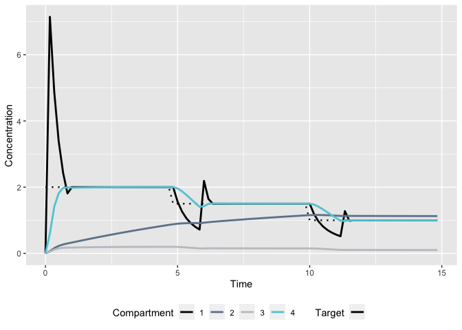
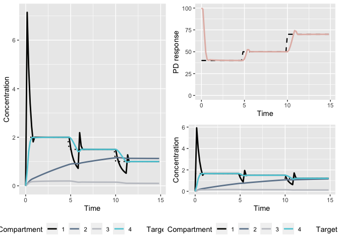
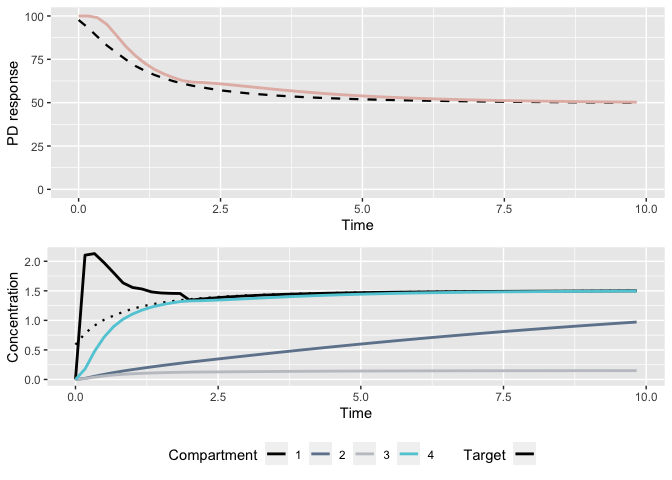
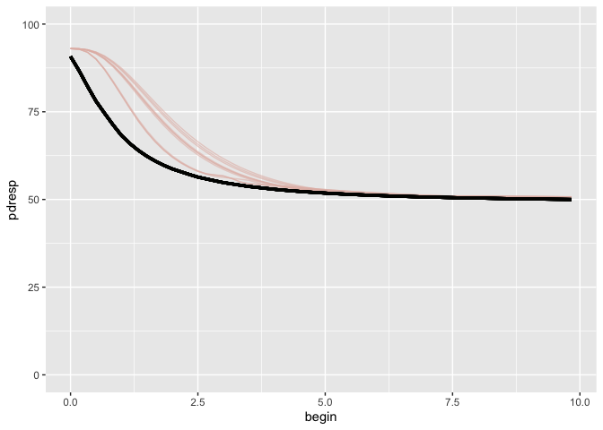
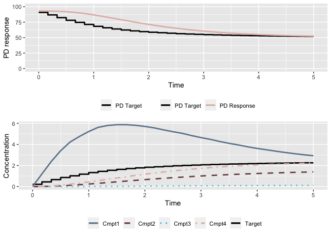
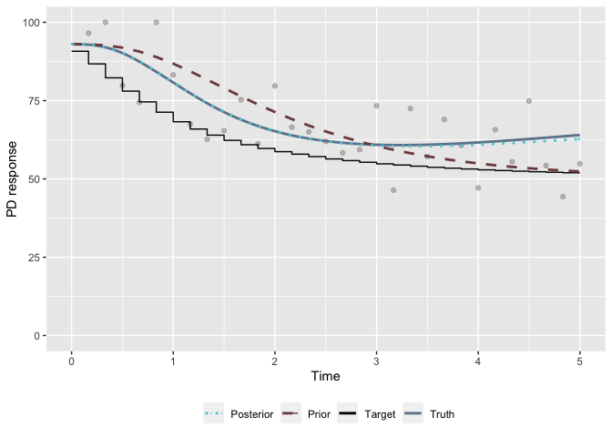
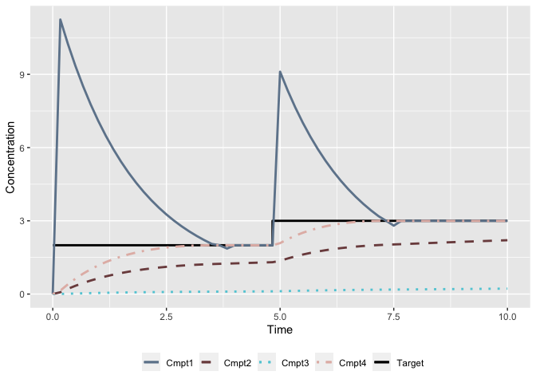
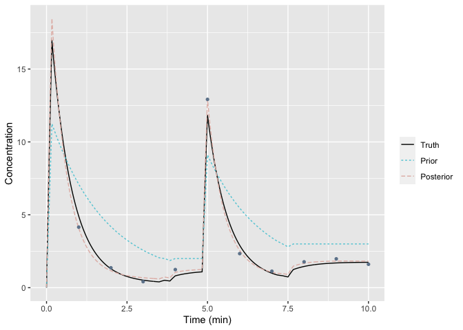

Selected examples using the TCI package
================
Ryan Jarrett
2/18/2020

## PK models

For illustration, we consider two PK models with IV infusions: a
one-compartment model, and a three-compartment model with an effect-site
compartment.

The functions below gives the predicted concentrations in each
compartment for both models associated with a continuous infusion of 1
mg/m over five minutes.

``` r
tms <- seq(0,5,0.1)
pars_1cpt <- c(ke = 0.1, v = 10)
plot(tms, pkmod1cpt(tm = tms, kR = 1, pars = pars_1cpt, init = 0), type = "l", xlab = "min", ylab = "Cp")
```


``` r
pars_3cpt <- c(k10=1.5,k12=0.15,k21=0.09,k13=0.8,k31=0.8,v1=10,v2=15,v3=100,ke0=1)
con <- pkmod3cptm(tm = tms, kR = 1, pars = pars_3cpt, init = c(0,0,0,0))
plot(tms, tms, type = "n", ylim = range(con), ylab = "concentration (mg/mL)", xlab = "min")
sapply(1:nrow(con), function(i) lines(tms, con[i,], col = i)); legend("topleft", paste("compartment",1:4), col = 1:4, lty = 1, cex = 0.8, bty = "n")
```

    ## [[1]]
    ## NULL
    ## 
    ## [[2]]
    ## NULL
    ## 
    ## [[3]]
    ## NULL
    ## 
    ## [[4]]
    ## NULL


We now need to be able to extend each PK function to any arbitrary
infusion schedule. We do this by writing predict method for PK models
that takes in a dosing schedule and returns predicted concentrations
either for a grid of points across the duration of the dosing interval,
or at specified time points.

``` r
# predict for 1cpt model
head(predict(pkmod = pkmod1cpt, inf = create_intvl(dose), pars = pars_1cpt, init = 2, return_init = T))
```

    ##           time       c1
    ## [1,] 0.0000000 2.000000
    ## [2,] 0.1666667 3.619798
    ## [3,] 0.3333333 5.212822
    ## [4,] 0.5000000 6.779516
    ## [5,] 0.6666667 6.667461
    ## [6,] 0.8333333 6.557257

``` r
# predict for 3cpt model
head(predict(pkmod = pkmod3cptm, inf = create_intvl(dose), pars = pars_3cpt, return_init = T))
```

    ##           time       c1         c2          c3        c4
    ## [1,] 0.0000000 0.000000 0.00000000 0.000000000 0.0000000
    ## [2,] 0.1666667 1.372332 0.01213142 0.009322461 0.1152341
    ## [3,] 0.3333333 2.303477 0.04285376 0.031592030 0.3861326
    ## [4,] 0.5000000 2.951999 0.08600698 0.060772513 0.7345054
    ## [5,] 0.6666667 2.045738 0.12549303 0.083837533 0.9983239
    ## [6,] 0.8333333 1.461603 0.15227359 0.094919022 1.1098073

``` r
# predict for 3cpt model at specific values
head(predict(pkmod = pkmod3cptm, inf = create_intvl(dose), pars = pars_3cpt, tms = c(1,2,3)))
```

    ##      time        c1        c2         c3        c4
    ## [1,]    1 1.0812467 0.1708101 0.09872216 1.1317615
    ## [2,]    2 0.3558635 0.2129614 0.07501638 0.7619403
    ## [3,]    3 0.2081186 0.2204033 0.04809046 0.4439968

Finally, we create a plot method for PK models with set infusions.

``` r
plot(pkmod = pkmod1cpt, inf = create_intvl(dose), pars = pars_1cpt, title = "Plasma concentrations for a 1 compartment model")
```


``` r
plot(pkmod = pkmod3cptm, inf = create_intvl(dose), pars = pars_3cpt, title = "Concentrations for a 3 compartment model with an effect site")
```


## Target-controlled infusion (TCI) algorithms

All TCI algorithms are expected to take in a target concentration value,
a PK model, and the duration of the infusion administered. Additional
arguments specifying aspects such as the maximum infusion rate or the
target compartment may be provided. When users want to supply a custom
TCI algorithm, they will write an algorithm such as the one above that
returns an infusion for a single target, as well as the amount of time
required to do so. Later on we will provide a function that extends any
TCI algorithm to multiple targets. TCI algorithms should return a vector
of length 2 with named values “kR” and “dt” indicating the infusion rate
and the duration of the infusion.

The algorithm below makes use of the approximate linearity in plasma
concentrations associated with a continuous infusion and returns the
infusion required to reach the target if administered for a duration of
`dt`.

``` r
# find infusion to increase plasma concentration to 2 within 2 minutes.
inf_est <- tci_plasma(Cpt = 2, dt = 2, pkmod = pkmod1cpt, pars = pars_1cpt) 
# verify that infusion will reach target at 2 minutes
plot(pkmod1cpt, pars = pars_1cpt, inf =  create_intvl(data.frame(time = c(2, 20), infrt = c(inf_est[1],0))), 
     title = "Infusion required to reach a plasma concentration of 2")
```


``` r
# test for 3 compartment model with initial concentration in central compartment
inf_est <- tci_plasma(Cpt = 2, dt = 2, pkmod = pkmod3cptm, pars = pars_3cpt, init = c(1,0,0,0)) 
plot(pkmod3cptm, pars = pars_3cpt, inf =  create_intvl(data.frame(time = c(2, 20), infrt = c(inf_est[1],0))), 
     init = c(1,0,0,0), title = "Infusion required to reach a plasma concentration of 2 in a 3cmpt model")
```


Now, we also create an effect-site TCI algorithm. This algorithm returns
the infusion that, if administerd for a duration of `dt`, will reach the
effect-site target in the minimum amount of time without overshoot.

``` r
# calculate the 10 second infusion rate required to reach a concentration of 1 ug/ml in the effect-site compartment with existing drug in the first compartment. 
kR_Cet <- tci_effect(Cet = 1, pkmod = pkmod3cptm, pars = pars_3cpt, init = c(1,0,0,0), dt = 1/6)
inf <- create_intvl(data.frame(time = c(1/6, 20), infrt = c(kR_Cet["kR"],0)))
plot(pkmod3cptm, inf, pars = pars_3cpt, init = c(1,0,0,0), 
     title = "10-sec infusion to reach a Cet of 1 in a 3cmpt model with initial cons")
```


``` r
# The algorithm may also be used to specify target different compartments, if desired. 
# Find 1 minute infusion required to reach a concentration of 0.5 in compartment 2 with no prior infusions. 
infdt = 1
kR_Cet_cmpt2 <- tci_effect(Cet = 0.5, pkmod = pkmod3cptm, pars = pars_3cpt, init = c(0,0,0,0), dt = infdt, cmpt = 2)
inf_cmpt2 <- create_intvl(data.frame(time = c(infdt, 20), infrt = c(kR_Cet_cmpt2["kR"],0)))
plot(pkmod3cptm, inf_cmpt2, pars = pars_3cpt, init = c(0,0,0,0),
     title = "1-min infusion to reach a c2 con of 0.5 in a 3cmpt model")
```


We now need a function to iterate any arbitrary TCI algorithm across a
series of targets. By default, the function will update infusion rates
at fixed intervals (e.g. every 10 seconds); however, users will have the
option of waiting only calculating infusions after the prior target has
been obtained.

The user passes the `tci` function a matrix of target concentrations and
times at which the target is set. This is translated into a step
function that defines the concentration target at all times.

``` r
tms <- c(0,5,10,15)
Cet <- c(2,1.5,1,1)
plot(stepfun(tms[-1], Cet), ylim = c(0,2), xlim = c(0,15), 
     main = "Plasma-targeting TCI algorithm", xlab = "min", ylab = "concentration", 
     col = pal[1])

# one compartment model
tci_1cpt <- tci(Cet, tms, pkmod = pkmod1cpt, pars = pars_1cpt, tci_alg = "plasma")
lines(tci_1cpt$begin, tci_1cpt$c1_start, col = pal[2])

# three compartment model
tci_3cpt <- tci(Cet, tms, pkmod = pkmod3cptm, pars = pars_3cpt, tci_alg = "plasma")
lines(tci_3cpt$begin, tci_3cpt$c1_start, col = pal[3])
legend("bottomright", c("One compartment", "Three compartments"), lty = c(1,1), col = pal[c(2,3)], cex = 0.8, bty = "n")
```


``` r
par(mfrow = c(1,2))
# effect-site targeting
tci_3cpt_effect <- tci(Cet, tms, pkmod = pkmod3cptm, pars = pars_3cpt)
plot(stepfun(tms[-1], Cet), ylim = c(0,7), xlim = c(0,15), main = "Plasma-targeting TCI algorithm", 
     xlab = "min", ylab = "concentration")
lines(tci_3cpt_effect$begin, tci_3cpt_effect$c1_start, col = pal[2])
lines(tci_3cpt_effect$begin, tci_3cpt_effect$c4_start, col = pal[3])
legend("topright", c("Plasma", "Effect site"), lty = c(1,1), col = pal[c(2,3)], cex = 0.8, bty = "n")

# effect-site targeting with initial concentrations
tci_3cpt_effect_init <- tci(Cet, tms, pkmod = pkmod3cptm, pars = pars_3cpt, init = c(2,0,0,2))
plot(stepfun(tms[-1], Cet), ylim = c(0,3), xlim = c(0,15), 
     main = "Plasma-targeting TCI algorithm", xlab = "min", ylab = "concentration")
lines(tci_3cpt_effect_init$begin, tci_3cpt_effect_init$c1_start, col = pal[2])
lines(tci_3cpt_effect_init$begin, tci_3cpt_effect_init$c4_start, col = pal[3])
legend("topright", c("Plasma", "Effect site"), lty = c(1,1), col = pal[c(2,3)], cex = 0.8, bty = "n")
```


``` r
par(mfrow = c(1,1))
```

## Pharmacodynamic (PD) models

The user is also able to specify a PD model along with a PK model and
pass on target PD values, which are translated into target
concentrations through the inverse PD function, and then into infusion
rates through a specified TCI algorithm.

We illustrate the incorporation of a PD model using the four-parameter
Emax model.

``` r
# Emax model
pars_emax <- c(c50 = 1.5, gamma = 4, e0 = 100, emx = 100)
ce_seq <- seq(0,4,0.1)
plot(ce_seq, emax(ce_seq, pars_emax), type = "l", 
     xlab = "Effect-site concentrtion (ug/mL)", ylab = "BIS", ylim = c(0,100))
```


``` r
# inverse Emax model
all.equal(inv_emax(emax(ce_seq, pars_emax), pars_emax), ce_seq)
```

    ## [1] TRUE

We create a plotting method for PD models that allows the user to pass
in a PK-PD model and an infusion schedule and plots the corresponding PK
and PD profiles.

``` r
plot(pdmod = emax, 
     pkmod = pkmod3cptm, 
     pars_pd = pars_emax, 
     pars_pk = pars_3cpt, 
     inf = create_intvl(data.frame(time = c(2,4,6,10), 
                                   infrt = c(400,0,400,0))), 
     title = "Predicted PK-PD responses")
```


``` r
tms <- seq(0,15,5)
bist <- c(40,50,70,70)
tci_bis_res <- tci_pd(pdresp = bist, 
                      tms = tms, 
                      pdinv = inv_emax, 
                      pdmod = emax,
                      pkmod = pkmod3cptm,
                      pars_pk = pars_3cpt,
                      pars_pd = pars_emax)

# plot TCI object with/without pd response
grid.arrange(plot(tci_3cpt_effect), plot(tci_bis_res), ncol = 2)
```



## Simulation functions

We need a function to generate data from a specified PK or PK-PD model
given a set of infusions. The infusions are passed in the form of a
matrix with columns specifying the infusion rate, the infusion duration,
and the starting time of the infusion with the column headers
(“infrt”,“begin”,“end”). All of these are provided as outputs from
both the `create_intvl` and the `tci` functions, so that the outputs can
be passed directly to the `gen_data` function. Data can be generated at
alternate times by specifying a set of times through the `tms` argument.

``` r
# new set of PK parameters for 3 compartment model
pars_3cpt0 <- c(k10=1.7,k12=0.13,k21=0.1,k13=0.8,k31=0.8,v1=15,v2=16,v3=90,ke0=1.2)
# generate PK data sampled each minute with multiplicative error
pkdsim <- gen_data(inf = create_intvl(dose), pkmod = pkmod3cptm, pars_pk0 = pars_3cpt0, 
         tms = seq(0,10,1), sigma_mult = 0.5)
head(pkdsim$sim)
```

    ##   time           c1        c2         c3        c4         cobs
    ## 1    0 5.088522e-16 0.0000000 0.00000000 0.0000000 2.379678e-16
    ## 2    1 6.418808e-01 0.1315914 0.10400430 0.7868619 3.091351e-01
    ## 3    2 1.980316e-01 0.1585140 0.07587971 0.4506107 1.787370e-01
    ## 4    3 1.135529e-01 0.1606567 0.04729925 0.2344957 1.292126e-01
    ## 5    4 7.191600e-02 0.1558671 0.02934405 0.1313347 3.212900e-02
    ## 6    5 6.888149e-01 0.2793757 0.12240028 0.8655525 4.869976e-01

``` r
# generate PK data for infusions starting at time t=10 using 
# final concentrations from prior simulation as initial values
dosetm10 <- dose
dosetm10$time  <- dosetm10$time+10
inittm10 <- unlist(tail(pkdsim$sim[,c("c1","c2","c3","c4")], 1))
pkdsimtm10 <- gen_data(inf = create_intvl(dosetm10, inittm = 10), 
                       pkmod = pkmod3cptm, 
                       pars_pk0 = pars_3cpt0, 
                       tms = seq(10,20,1), 
                       sigma_mult = 0.5, 
                       init = inittm10)
head(pkdsimtm10$sim)
```

    ##   time         c1        c2         c3         c4        cobs
    ## 1   10 0.04104811 0.2375391 0.01427799 0.06184166 0.001100566
    ## 2   11 2.57031392 0.4186417 0.17941082 1.38331245 1.146760623
    ## 3   12 3.06976550 0.7106685 0.34576793 2.44599128 0.250837320
    ## 4   13 3.32465164 1.0153404 0.45130792 2.99557225 2.993476281
    ## 5   14 3.48325990 1.3143458 0.51668983 3.29577876 4.141941835
    ## 6   15 3.58579764 1.5997175 0.55750275 3.47204893 1.566646354

``` r
# new set of PD parameters for Emax model
pars_emax0 <- c(c50 = 1.2, gamma = 3.5, e0 = 100, emx = 100)

# Simulate PK-PD data under model misspecification.
# Predicted concentrations / responses under model with pars "pars_3cpt", "pars_emax"
tci_bis_res <- tci_pd(pdresp = c(40,50,70,70), 
                      tms = c(0,5,10,15), 
                      pdinv = inv_emax, 
                      pdmod = emax,
                      pkmod = pkmod3cptm,
                      pars_pk = pars_3cpt,
                      pars_pd = pars_emax)
# Generate data using infusion schedule above under a different PK-PD model
pkpddsim <- gen_data(inf = tci_bis_res, 
                     pkmod = pkmod3cptm, pars_pk0 = pars_3cpt0, 
                     pdmod = emax, pars_pd0 = pars_emax0,
                     sigma_add = 7, delay = 15/60, max_pdval = 100)

# Generate data at time t=15 with new targets and starting concentrations
tci_bis_res_init <- tci_pd(pdresp = c(40,50,70,70), 
                           tms = c(0,5,10,15)+15, 
                           pdinv = inv_emax, 
                           pdmod = emax,
                           pkmod = pkmod3cptm,
                           pars_pk = pars_3cpt,
                           pars_pd = pars_emax, 
                           init = unlist(tail(
                             pkpddsim$inf[,c("c1_end","c2_end","c3_end","c4_end")]
                             ,1))
                           )

# pass in true concentrations as starting concentrations
pkpddsim_init <- gen_data(inf = tci_bis_res_init, 
                          pkmod = pkmod3cptm, pars_pk0 = pars_3cpt0, 
                          pdmod = emax, pars_pd0 = pars_emax0,
                          sigma_add = 7, delay = 15/60, max_pdval = 100,
                          init = unlist(tail(
                            pkpddsim$sim[,c("c1","c2","c3","c4")]
                            ,1)))
```

We also create a plot method for simulated data.

``` r
p1 <- plot(pkpddsim)
p2 <- plot(pkpddsim_init)
p12 <- plot(combine_sim(pkpddsim, pkpddsim_init))
grid.arrange(p1,p2,p12, layout_matrix = matrix(c(1,3,2,3),2,2))
```


We now define functions to generate hypothetical patient PK-PD data
according to specified population PK or PK-PD models. While a number of
commonly used models are provided in the file `poppk_mods.R`, such as
the Marsh and Schnider PK models or the Eleveld PK-PD model, it is also
possible for the user to define custom PK models. Each model should take
in a dataframe of patient covariates and perform the relevant
computation to calculate the patient’s corresponding PK or PK-PD
parameters. If random sampling from the population model is desired, it
should be performed within the population PK or PK-PD function using the
argument `rand`.

``` r
# Simulate PK-PD for patients based on eleveld data
data(eleveld_pk)
eleveld_poppk(eleveld_pk[1:5,], rate = T) # pk data only with rate parameters
```

    ##   ID       V1       V2        V3      CL     Q2      Q3 AGE WGT HGT M1F2    PMA
    ## 1  1 6.094689 16.03328  92.05801 0.94078 1.3973 0.30748  59  64 166    2 59.769
    ## 2  2 6.418785 17.92993 127.98594 1.22260 2.7529 0.71072  62  75 182    1 62.769
    ## 3  3 7.057352 27.39669 154.54782 1.13110 1.1355 0.40712  57 106 171    1 57.769
    ## 4  4 6.470785 21.18278 138.43466 1.20770 1.6362 0.53274  53  77 170    1 53.769
    ## 5  5 6.592913 16.51225 106.75174 1.29930 1.3493 0.47513  73  82 167    1 73.769
    ##   TECH    BMI    FFM A1V2       K10       K12        K21        K13         K31
    ## 1    2 23.225 41.467    1 0.2721425 0.2084115 0.07922295 0.08175547 0.005412610
    ## 2    2 22.642 60.087    1 0.2459595 0.2149238 0.07694115 0.09949187 0.004989743
    ## 3    2 36.250 67.721    1 0.2941497 0.2692390 0.06935561 0.10405293 0.004751527
    ## 4    2 26.644 57.402    1 0.2553349 0.2426171 0.07411316 0.10431770 0.004876072
    ## 5    2 29.402 58.334    1 0.2481079 0.1959639 0.07824332 0.08480119 0.005237262
    ##   LN_SIGMA     CE50       KE0 BIS0 GAMMA GAMMA2 SIGMA BIS_DELAY
    ## 1    0.191 2.644626 0.1493078   93  1.47   1.89  8.03  36.12168
    ## 2    0.191 2.594723 0.1435034   93  1.47   1.89  8.03  39.66536
    ## 3    0.191 2.678427 0.1316136   93  1.47   1.89  8.03  34.04682
    ## 4    0.191 2.747330 0.1425623   93  1.47   1.89  8.03  30.48853
    ## 5    0.191 2.419666 0.1403376   93  1.47   1.89  8.03  58.55829

``` r
eleveld_poppk(eleveld_pk[1:5,], rate = F, PD = T, rand = T) # pk-pd data with clearance parameters and random error 
```

    ##   ID        V1       V2        V3        CL       Q2        Q3 AGE WGT HGT M1F2
    ## 1  1  6.219795 40.69695  83.57810 1.3139497 2.214117 0.7223069  59  64 166    2
    ## 2  2  5.677130  9.58653 242.17476 0.8774518 1.295344 1.1508635  62  75 182    1
    ## 3  3  4.030690 27.76121 127.51092 3.9786633 1.353329 0.6582838  57 106 171    1
    ## 4  4  5.953983 38.85434  59.15153 1.6181394 1.385790 0.1885998  53  77 170    1
    ## 5  5 13.362108 15.34381  59.29652 1.3183391 1.542915 0.3506450  73  82 167    1
    ##      PMA TECH    BMI    FFM A1V2   LN_SIGMA      CE50       KE0 BIS0 GAMMA
    ## 1 59.769    2 23.225 41.467    1 0.28336339 5.5845224 0.1320561   93  1.47
    ## 2 62.769    2 22.642 60.087    1 0.29580214 3.5457597 0.1269224   93  1.47
    ## 3 57.769    2 36.250 67.721    1 0.15035779 1.1232657 0.1164064   93  1.47
    ## 4 53.769    2 26.644 57.402    1 0.06755958 2.1606557 0.1260900   93  1.47
    ## 5 73.769    2 29.402 58.334    1 0.07661450 0.8487266 0.1241223   93  1.47
    ##   GAMMA2     SIGMA BIS_DELAY
    ## 1   1.89  9.620513  36.12168
    ## 2   1.89  6.785673  39.66536
    ## 3   1.89  4.239773  34.04682
    ## 4   1.89 10.996949  30.48853
    ## 5   1.89 10.610668  58.55829

We now illustrate how the functions written can be applied to generate
infusion schedules designed to match values of a target sigmoid
function.

``` r
tms_sigmoid <- seq(0,10,1/60) # 10 minute induction with target sigmoid
targets_sigmoid <- emax(tms_sigmoid, restrict_sigmoid(1)) # parameters restricted to reach mid point at t=1 minute

# parameters of Emax model
pars_emax <- c(c50 = 1.5, gamma = 4, e0 = 100, emx = 100)

# apply tci algorithm to sigmoid targets
sig_tci_targets <- tci_pd(pdresp = targets_sigmoid, 
                          tms = tms_sigmoid, 
                          pdinv = inv_emax, 
                          pdmod = emax,
                          pkmod = pkmod3cptm,
                          pars_pk = pars_3cpt,
                          pars_pd = pars_emax)
plot(sig_tci_targets)
```



We now can illustrate what open-loop TCI control would look like for a
population of patients. For this we use a sample of 10 patients from the
population of 122 patients with PK-PD observations included in the
Eleveld et al. (2018) dataset. We first simulate the expected time-BIS
course for each patient when the correct patient models are passed on to
the TCI algorithm. We later illustrate the same situation in which
patient parameters are simulated with random error to reflect a more
accurate clinical scenario.

It is worth noting that the hill parameter (“gamma”) in the Eleveld PD
model is fixed across the population, but varies between two values
depending on if the effect-site concentration is greater than the
concentration required for 50% effect. To implement this, a modification
of the Emax function and its inverse is required.

``` r
## Simulation without error
# Note: the parameter estimates in the Eleveld dataset are the EB estimates rather than the prior estimates

# predicted model parameters for each patient - simulate without random error
ix <- ceiling(seq(1,122,length.out = 10))
eleveld_pop_prior <- eleveld_poppk(eleveld_pk[ix,], rate = T, PD = T, rand = F)
# simulate true patient parameters
set.seed(1)
eleveld_pop <- eleveld_poppk(eleveld_pk[ix,], rate = T, PD = T, rand = T)

# sigmoid targets
tms_sigmoid <- seq(0,10,1/60) # 10 minute induction with target sigmoid
targets_sigmoid <- emax(tms_sigmoid, restrict_sigmoid(1, BIS0 = eleveld_pop$BIS0[1]))

# apply tci algorithm to sigmoid targets
sig_tci_pop <- lapply(1:nrow(eleveld_pop), function(i){
        
        # base tci infusions on prior parameter estimates
        pars_pki <- unlist(eleveld_pop_prior[i,c("K10","K12","K21","K13","K31","V1","V2","V3","KE0")])
        pars_pdi <- unlist(eleveld_pop_prior[i,c("CE50","GAMMA","GAMMA2","BIS0","BIS0")])
        names(pars_pdi) <- c("c50","gamma","gamma2","e0","emx")
        out <- tci_pd(pdresp = targets_sigmoid, 
                        tms = tms_sigmoid, 
                        pdinv = inv_emax_eleveld, 
                        pdmod = emax_eleveld,
                        pkmod = pkmod3cptm,
                        pars_pk = pars_pki,
                        pars_pd = pars_pdi)
        out$id <- i
        out
})

sig_pop_df <- do.call("rbind", lapply(sig_tci_pop, `[`, c("id","begin","pdt","pdresp")))
ggplot(sig_pop_df, aes(x = begin, y = pdresp, group = id)) + 
        geom_line(alpha = 0.6, color = pal[5]) +
        geom_line(aes(x = begin, y = pdt), color = pal[1], size = 1.2) + 
        lims(y = c(0,100))
```



``` r
# apply tci algorithm to sigmoid targets
sig_tci_datasim <- lapply(1:nrow(eleveld_pop), function(i){
        
        # generate data based on "true" parameter values
        pars_pki0 <- unlist(eleveld_pop[i,c("K10","K12","K21","K13","K31","V1","V2","V3","KE0")])
        pars_pdi0 <- unlist(eleveld_pop[i,c("CE50","GAMMA","GAMMA2","BIS0","BIS0")])
        names(pars_pdi0) <- c("c50","gamma","gamma2","e0","emx")
        
        # simulate data based on 
        out <- gen_data(inf = sig_tci_pop[[i]], 
                        pkmod = pkmod3cptm, 
                        pdmod = emax_eleveld, 
                        pars_pk0 = pars_pki0, # true pk parameters
                        pars_pd0 = pars_pdi0, # true pd parameters
                        sigma_add = eleveld_pop[i,"SIGMA"], # random error
                        delay = eleveld_pop[i,"BIS_DELAY"], # bis delay
                        max_pdval = 100,
                        init = c(0,0,0,0))
        out$sim$id <- i
        out
})

sig_tci_datasim_df <- subset(
        do.call("rbind", lapply(sig_tci_datasim, `[[`, "sim")), 
        select = c(id,time,pd0,pdobs)
        )
        
ggplot(sig_pop_df, aes(x = begin, y = pdresp, group = id)) + 
        geom_line(aes(x = begin, y = pdt, group = id, color = "Target"), 
                  size = 1.2) + 
        geom_line(alpha = 0.6, aes(color = "Predicted")) +
        geom_line(data = sig_tci_datasim_df, 
                  aes(x = time, y = pd0, group = id, color = "Observed"), 
                  alpha = 0.6) +
        lims(y = c(0,100)) +
        scale_color_manual(name = "", 
                     values = c("Target"    = unname(pal[1]), 
                                "Predicted" = unname(pal[2]),
                                "Observed"  = unname(pal[5])))
```


With the functions created, we now have the capability of simulating TCI
systems under open-loop control. We have not yet, however, incorporated
population-level uncertainty within the simulations or created functions
to provide closed-loop control.

First, we address the incorporation of closed-loop control. Due to the
computation demands of simulating under closed-loop control, we only
allow for simulation of one patient at a time. Within this package,
closed-loop control is provided via Bayesian updates to model
parameters.

In order to perform these updates, the user must define a prior
distribution. The function `log_prior` calculates the logged value of
prior distribution at a set of logged parameter values given a specific

``` r
# update after 2 minutes of following sigmoid targets with observations collected every second
starttm = 0; endtm = 2; dt = 1/60
tms_sigmoid <- seq(starttm,endtm,dt) # 10 minute induction with target sigmoid
targets_sigmoid <- emax(tms_sigmoid, restrict_sigmoid(1, BIS0 = 93)) # parameters restricted to reach mid point at t=1 minute

# prior pk-pd parameters for 1st patient in Eleveld dataset
pars_pk_prior <- unlist(eleveld_pop_prior[1,c("K10","K12","K21","K13","K31","V1","V2","V3","KE0")])
pars_pd_prior <- unlist(eleveld_pop_prior[1,c("CE50","GAMMA","GAMMA2","BIS0","BIS0")])
names(pars_pd_prior) <- c("c50","gamma","gamma2","e0","emx")

# evaluate prior distribution 
# the 'elvdlpars' function extracts the pk-pd parameters from the Eleveld dataset
lpr_eval <- elvdlpars(eleveld_pop_prior[1,])
mu0 <- elvdlpars(eleveld_pop[1,])
sig0 <- poppk_cov("Eleveld")

log_prior(lpr = lpr_eval, mu = mu0, sig = sig0)
```

    ## [1] -9.882563

``` r
# Calculate tci infusions at prior parameter estimates
inf <- tci_pd(pdresp  = targets_sigmoid, 
              tms     = tms_sigmoid, 
              pdinv   = inv_emax_eleveld, 
              pdmod   = emax_eleveld,
              pkmod   = pkmod3cptm,
              pars_pk = pars_pk_prior,
              pars_pd = pars_pd_prior)

# expected time course under correct model specification
plot(inf)
```



``` r
# true pk-pd parameters for patient
pars_pk_true <- unlist(eleveld_pop[1,c("K10","K12","K21","K13","K31","V1","V2","V3","KE0")])
pars_pd_true <- unlist(eleveld_pop[1,c("CE50","GAMMA","GAMMA2","BIS0","BIS0")])

# simulate data based on true pk-pd parameters
# generate observations every second
tms <- seq(dt,endtm,dt)
dat <- gen_data(inf = inf, 
                tms = tms,
                pkmod = pkmod3cptm, 
                pdmod = emax_eleveld, 
                pars_pk0 = pars_pk_true, # true pk parameters
                pars_pd0 = pars_pd_true, # true pd parameters
                sigma_add = eleveld_pop[1,"SIGMA"], # random error
                delay = eleveld_pop[1,"BIS_DELAY"]/60, # bis delay in minutes
                max_pdval = 100,
                init = c(0,0,0,0))

# fixed parameters that need to be used, but aren't evaluated in likelihood
# ordering of parameters is important to correct use of PD function
fixed_lpr <- log(as.numeric(eleveld_pop_prior[1,c("GAMMA","GAMMA2","BIS0","BIS0")]))

# update parameter estimates with data
post_est <- nlm(f = log_posterior_neg, 
                p = unname(elvdlpars(eleveld_pop_prior[1,])),
                dat = dat, 
                mu = unname(elvdlpars(eleveld_pop[1,])),
                sig = poppk_cov("Eleveld"),
                fixed_lpr = fixed_lpr, 
                hessian = T)

plot(dat, 
     lpars_prior = elvdlpars(eleveld_pop_prior[1,]),
     lpars_update = post_est$estimate, 
     lpars_fixed = fixed_lpr,
     pd_ix = 10)
```



Though it is less common to have closed-loop control via Bayesian
updates applied at the PK level (due to the time requirement of
processing samples), it nonetheless is also possible.

``` r
# update after 10 minutes of targeting 2 ug/ml for the first 5 minutes and 3 ug/ml for the second 5 minutes, with samples drawn each minute

# prior pk parameters for 1st patient in Eleveld dataset
pars_pk_prior <- unlist(eleveld_pop_prior[1,c("K10","K12","K21","K13","K31","V1","V2","V3","KE0","LN_SIGMA")])

# true pk-pd parameters for patient
pars_pk_true <- unlist(eleveld_pop[1,c("K10","K12","K21","K13","K31","V1","V2","V3","KE0","LN_SIGMA")])

# pass in values to be targeted at each time
inf <- tci(Ct    = c(2,3,3),
           tms   = c(0,5,10), 
           pkmod = pkmod3cptm,
           pars  = pars_pk_prior)

# plot infusion schedule with predicted concentrations
plot(inf)
```



``` r
# parameter estimates and prior mean/covariance
lpr_eval <- elvdlpars(eleveld_pop_prior[1,], pd = F)
mu0 <- elvdlpars(eleveld_pop[1,], pd = F)
sig0 <- poppk_cov("Eleveld", pd = F)

# simulate data based on true pk parameters
# generate observations every minute
dat <- gen_data(inf = inf, 
                tms = 1:10,
                pkmod = pkmod3cptm, 
                pars_pk0 = pars_pk_true, # true pk parameters
                sigma_add = eleveld_pop[1,"LN_SIGMA"], # random error
                log_err = TRUE,
                init = c(0,0,0,0))

post_est <- nlm(f = log_posterior_neg, 
                p = lpr_eval,
                dat = dat, 
                mu = mu0,
                sig = sig0,
                pd_ix = NULL, 
                err_ix = 10,
                hessian = T)

plot(dat, lpars_prior = lpr_eval, lpars_update = post_est$estimate)
```



<!-- NOTE: Do we want to incorporate controllers that directly effect the dose? How? No need to do this yet. Existing programs like stanpump only provide one mechanism for closed-loop control.-->

We now write a function to simulate the course of an infusion schedule
with closed-loop control. The user needs to specify:

1)  A PK or PK-PD model
2)  A set of targets
